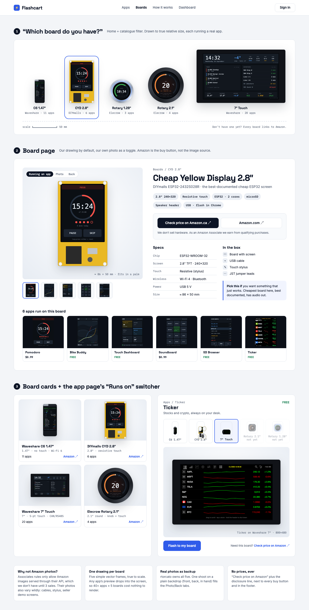

# Store design

Design spec for the web store in `store/`, where people browse apps by board, see
each board, and buy boards through Amazon affiliate links. Approved by rtorcato
on 2026-10-07.

## Principles

- **We draw the boards.** Every board is a vector frame at true relative size,
  with a real app preview in its screen. We don't use Amazon product photos.
  Amazon Associates only allows its images through the Product Advertising API,
  and the listing photos are inconsistent anyway. Our own photos can come later
  as a Photo/Back tab.
- **No prices on hardware.** Show "Check price on Amazon" links, with the
  disclosure line next to every buy button.
- **Apps sell the board.** A board page leads with the board running an app,
  and an app page lets you flip between the boards it runs on.

## Screens and components

| Screen / component | Contents |
|---|---|
| Home: board picker | "Which board do you have?" shows all 5 boards at true relative size on a dashed baseline. Each board has its name, maker and app count under it, plus a 50 mm scale bar. Each board links to `/boards/$board`. |
| `BoardFrame` | `board`, `app`, `scale` (px per mm). Draws the bezel or PCB, the glass, and the app preview clipped to the screen rect (a circle on the rotary boards). |
| Board card | Stage with the frame, board name, a one-line meta line (screen · touch · standout feature), app count, and an Amazon link. |
| Board page `/boards/$board` | Stage, thumbnails to swap apps, H1, maker line, spec chips, buy box, specs table, "In the box", "Pick this if…", and the compatible apps grid. |
| Buy box | An ink button "Check price on Amazon.ca ↗", an outline button "Amazon.com ↗", and the disclosure line under them. |
| App page `/apps/$app` | Name, price label (FREE / $0.99), a "Runs on" segmented switcher with mini frames, a hero frame, "Flash to my board" (primary), and a "Need this board?" link. |

## Rules

- Amazon links use `target="_blank" rel="sponsored noopener"`, with sr-only
  text "(opens Amazon)". The Associates tag lives in one config constant.
- The disclosure text is "As an Amazon Associate we earn from qualifying
  purchases." It appears under every buy box and in the footer, at 13px or
  larger.
- Boards an app doesn't support yet are `aria-disabled`, with the visible text
  "not yet" and a blank screen. Never signal this with opacity alone.
- Alt text follows "{App} running on {Board}". An image inside a link that
  already has text gets `alt=""`.
- Use cobalt `primary` only for app actions. The Amazon CTA is an ink button.
- Every interactive element has a 2px `ring` focus outline with a 2px offset.
  Touch targets are at least 44px tall, and buttons are 48px.
- Responsive (<768px):
  - The picker becomes a horizontal scroll-snap row at scale 1.2.
  - The board page stacks in this order: stage, title, buy box, details.
  - The app grid goes from 6 to 3 to 2 columns, and cards from 2 to 1.
- Don't use cream/ivory backgrounds with terracotta or coral accents.

## Tokens ("Bench", light only)

| Token | Value | Use |
|---|---|---|
| `background` | `#F3F5F8` | Page |
| `foreground` | `#0D1526` | Ink: text, Amazon button |
| `card` / `popover` | `#FFFFFF` | Panels, cards |
| `muted` / `secondary` | `#EBEFF5` | Chips, thumbnails |
| `muted-foreground` | `#566174` | Secondary text (5.7:1 on background) |
| `border` / `input` | `#DCE2EA` | Hairlines |
| `primary` / `ring` | `#2F5BEA` | App actions, focus, selection (white text 5.5:1) |
| `accent` | `#F1F4FE` | Selected tile, "Pick this if" callout |
| `free` | `#0E7A4B` | FREE label (5.4:1 on white) |
| stage | `radial-gradient(circle at 50% 40%, #FFFFFF, #E7ECF3)` | Behind every device |

Radius is 10px for buttons and thumbnails, 12px for cards and 14px for panels.
Chips are pills.

### Device frame colours

| Part | Value |
|---|---|
| C6 bar body | `#20242B → #14171C` |
| CYD PCB | `#E9B824`, edge `#C99A12` |
| 7″ bezel | `#111318` |
| Glass | `#05070B` |
| Rotary 2.1″ ring | dark conic `#3B3F47 / #1C1F24 / #4A4F58` |
| Rotary 1.28″ ring | silver conic `#E6E9EE / #9AA1AB / #F4F6F9`, glow `rgba(80,140,255,.65)` |

Outer sizes in mm, all **approximate** (verify against the real boards):
C6 20×47, CYD 50×86 (portrait), 7″ 180×108, Rotary 2.1″ Ø72, Rotary 1.28″ Ø48.
Keep them in the board data file so they can be corrected in one place.

## Type

| Role | Font | Spec |
|---|---|---|
| Display | Space Grotesk 500/700 | H1 40px/1.1, -0.025em. Board and app names. |
| Body | Inter 400–700 | 16px/1.5 |
| Data | IBM Plex Mono 400–600 | 12–13px: chips, meta, spec labels, prices, breadcrumbs, the scale bar |

Self-host the fonts with `@fontsource`.

## Brand

Pending. Brand assets come from `npx @rtorcato/brand-kit` once the store name
is confirmed ("Flashcart" is the working name), and are added to `brand/` then.
