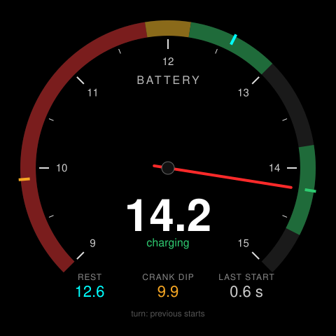

# battery-monitor — idea

The 12V battery is the most common thing to go wrong in a modern car and the
dash tells you nothing until it fails. One dial: **rest voltage** before the
start, the **cranking dip** as the starter pulls it down, and the **charging
voltage** once the alternator is running. The three numbers that say whether
the battery, the starter and the alternator are healthy, from one PID.

Standard PID `42` (control-module voltage), sampled fast around the crank.
Reference marks on the dial from config: 12.6 rest is full, below 12.2 is
tired, a crank dip under 9.6 is a battery on its way out, charging 13.8–14.6.

**Suits:** the 2.1" rotary: a voltage dial wants a round face, and the knob
pages back through the last starts.

## Hard parts

- Catching the crank: the dongle wakes with the ignition, the BLE connection
  takes a second or two, and the crank is over in 0.7s. Poll `42` at the
  fastest rate the dongle allows for the first ten seconds and keep the
  minimum. If the connection lands late, say `crank missed` rather than
  showing the rest voltage as the dip.
- Rest voltage is only meaningful after the car has sat: surface charge
  reads high for half an hour after a drive. Timestamp it and grey it out.
- History lives on the board (NVS, last 20 starts), because there is no SD on
  the rotary and no network in the car.
