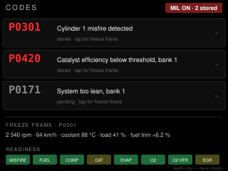

# code-reader — idea

The check-engine light says one thing; the codes behind it say what. This
lists stored and pending diagnostic trouble codes with a plain-English
description from a table on the SD card, the freeze-frame snapshot the ECU
kept when each one set (RPM, speed, coolant, load), and the readiness
monitors, so you know before an emissions test whether the car will pass.

Modes `03` (stored), `07` (pending), `02` (freeze frame), `01 01` (MIL and
readiness). Descriptions: the generic P0xxx set is public and ~2000 lines of
CSV, which is why it lives on the card and not in flash.

**Reads, never clears.** Mode `04` erases codes and the readiness monitors
with them, and this repo's rule for anything on a car bus is read-only. If
you want the light off, that is a deliberate act on a phone app, not a tap
on a panel that might be brushed.

**Suits:** the CYD, for the SD card and because a list wants a rectangle.

## Hard parts

- Manufacturer codes (P1xxx, and Porsche's own) are not in the public table.
  Show the code raw with `manufacturer-specific` and move on.
- Multi-frame responses: a car with several codes answers across ISO-TP
  frames and cheap dongles mangle them. Set `ATCAF1` and check the count.
- Pending codes come and go; don't alarm on one that clears itself on the
  next drive cycle. Mark them as pending, in grey.
