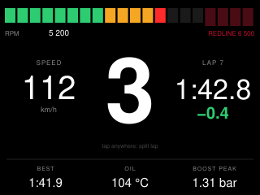

# track-page — idea

The page for a lapping day: an RPM bar across the top with the redline marked,
the gear large in the centre, speed left, lap time right, and the delta to the
best lap in green or red. Bottom strip: best lap, oil temperature, boost peak.

Speed and RPM are standard PIDs (`0D`, `0C`). Gear is **derived** from the
ratio of the two against a table in config, which is why it needs a car
profile (*ratios unverified*, easy to fill in from a spec sheet). Laps are
split on a tap, or automatically once a GPS breakout is added.

**Suits:** the CYD in landscape, because a lap page is rectangular, wants
bright big digits, and the whole screen is one tap target.

## Hard parts

- **This is where the dongle runs out.** A BLE ELM327 answers a handful of
  PIDs per 100ms and the RPM bar looks laggy at 5Hz. Ask for RPM and speed
  only while this page is up, and park the temperatures at one read every
  few seconds. If it still lags, this is the one app that justifies the
  wired transceiver path in the [notes](../../README.md).
- Gear guessing is wrong for a moment on every shift and in neutral. Blank
  it below a speed threshold and when the ratio is between two gears.
- Redline and the shift flash come from config: never assume.
- Mount it. Vibration and a resistive panel flying across the footwell are
  both bad, and this page will be looked at while moving. Keep everything
  readable from a glance and nothing that needs a second tap.
