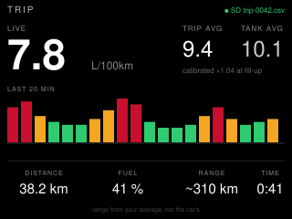

# trip-log — idea

What the trip computer shows, but honest and logged. Live consumption from the
air-flow PID, the average for this trip and for the tank, distance, fuel level
and a range estimate from *your* average rather than the car's optimistic one.
A small bar chart of the last twenty minutes shows where the fuel went. Every
sample goes to the SD card as CSV, one file per trip, for a spreadsheet later.

Standard PIDs: `10` MAF (or `0B`+`0C`+`0F` speed-density when there is no
MAF), `0D` speed, `2F` fuel level, `5E` engine fuel rate where the car has it.

**Suits:** the CYD. The SD slot on its own SPI bus is the reason: the other
boards have nowhere to put a season of logs.

## Hard parts

- Fuel from MAF is an estimate (air mass ÷ stoichiometric ratio ÷ density) and
  is wrong by a fixed factor per car. One calibration number in config,
  measured at a fill-up, and the app says `uncalibrated` until it is set.
- The fuel-level PID is coarse and sloshes. Filter it hard and never compute
  range from a single reading.
- Trip boundaries: ignition on is the start; twenty minutes with no speed is
  the end. Close the CSV cleanly on the dongle disconnecting, which is how
  most trips will end.
- Time: no network in the car, so timestamps come from the RTC, set the last
  time the board saw Wi-Fi. Say how stale it is in the file header.
