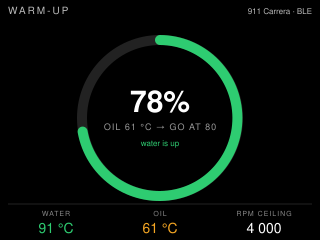

# warm-up — idea

Coolant comes up in a few minutes; oil takes two or three times longer, and
the dash only shows one of them. This is one ring that closes as **oil**
reaches its target, the current water and oil temperatures underneath, and the
RPM ceiling to hold until the ring is full. When both are up, the screen says
`GO` once and dims itself.

Standard PIDs only: `05` coolant, `5C` oil temperature. If the car does not
answer `5C` (*unverified on Porsche ECUs*), the ring falls back to coolant
plus a fixed delay, and says so on screen rather than pretending.

**Suits:** the CYD in landscape on the dash, or the 2.1" rotary where the
ring *is* the bezel and the knob sets the target temperature.

## Hard parts

- The RPM ceiling is a curve, not a step: 3000 cold, rising with oil
  temperature to the redline at target. Config holds three points.
- Polling: two PIDs at 1Hz is nothing; don't let this app teach the dongle
  loop a bad habit by asking faster.
- Go dark on `GO`, and wake on a tap. A screen that keeps saying "ready" is
  a distraction after the first second.
