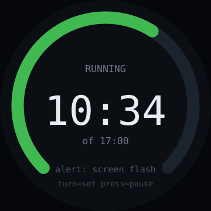

# desk-timer — idea

Turn the knob to dial in minutes, press to start, press again to pause, long-press
to reset. A depleting arc plus big centred digits. That's the whole app.

**Why this board:** setting a duration is exactly what a knob is for — dialling
"17 minutes" takes one gesture with no keypad and no touch precision. And a 240×240
round face showing one number is a perfect content fit rather than a compromise.

**Hard parts** — barely any, which is the point. This is the *first* app to build
on this board.

- Use `millis()` deltas rather than accumulated `delay()`, or it drifts.
- Encoder acceleration: fine steps for short turns, minute-jumps when spun fast,
  so a 90-minute timer isn't a wrist exercise.
- Signalling the end: this board has no speaker. Flash the whole screen and, if
  there's an LED, pulse it — or push a notification over Wi-Fi. Decide before
  building, because a silent timer that ends unnoticed is useless.
- Long-press vs. press needs a duration state machine, not just a press event.

**Pieces:** LVGL arc + label (or Arduino_GFX directly — at 240×240 SPI you don't
strictly need LVGL), interrupt-driven encoder, `Preferences` for the last-used
duration.

**Effort:** small. Good shakedown app for the encoder and the round layout before
attempting anything else here.
