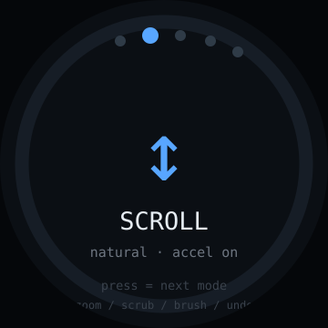

# scroll-knob — idea

A dedicated desktop input device. Turn to scroll, press to switch mode — scroll,
zoom, timeline scrub, brush size, undo/redo. The screen shows the active mode so
you know what the knob does before you turn it.

**Why this board:** cheap enough to leave permanently on the desk, and the small
round face is enough for a mode name and an icon. Because it's a *displayed*
mode, one physical knob becomes several tools — which is the advantage over a
plain hardware dial.

**Hard parts**

- **BLE HID** so the OS treats it as a standard mouse/keyboard and needs no
  driver: scroll is mouse wheel, zoom is ctrl+wheel, undo is a key combo. Start
  from a known-good HID descriptor rather than writing one from scratch.
- Modifier-key combos through HID are per-OS. ctrl+wheel zooms on Windows/Linux,
  cmd+wheel on macOS — make the modifier a config value, not a hardcoded one.
- Scroll feel is the entire product. Get acceleration and direction wrong and it
  is unusable; leave both as tunable constants and expect to iterate by hand.
  Natural-vs-reversed direction must be switchable.
- BLE reconnect after host sleep, same caveat as the 2.1" media knob — test it
  early.
- No host feedback: the knob can't know the current zoom level, so the display
  shows the *mode*, never a value it would guess at.

**Pieces:** `NimBLE-Arduino` with an HID descriptor, Arduino_GFX or LVGL,
interrupt-driven encoder, `Preferences` for mode + direction settings.

**Effort:** small-medium. Shares most of its BLE work with
[media-knob](../../elecrow-rotary-2.1/apps/media-knob/) — build one, then the
other is mostly a new descriptor and a new face.
