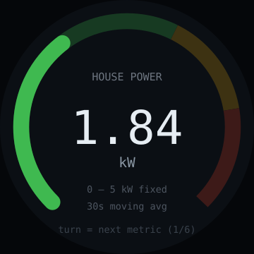

# single-gauge — idea

One value, one dial, done properly. Pick a metric — server CPU load, house power
draw, network throughput, indoor CO₂, a stock's day change — and show it as a
radial gauge with the number in the centre. Turn the knob to switch which metric
is displayed.

**Why this board:** 240×240 round can hold exactly one number and one arc, so
instead of fighting that constraint this app is built around it. The knob turns
the limitation into a feature: one screen at a time, spin to page through a set.

**Hard parts**

- **Choosing the metric is the actual design work.** A gauge is only worth glancing
  at if the value changes on a human timescale and has a meaningful range. CPU
  load and power draw work; total disk space does not.
- The range must be honest. Auto-scaling makes a gauge meaningless — a
  full-looking dial should mean the same thing every time you glance at it. Fix
  the min/max per metric in config, and clamp with a visible overflow indicator.
- Smooth the input. Raw per-second samples make the needle twitch; a short moving
  average reads far better without hiding real spikes.
- Data source: easiest is polling one HTTP/JSON endpoint (Prometheus, Home
  Assistant, an existing exporter). Don't build a collector — reuse one.
- Colour thresholds (green/amber/red) do more for glanceability than any amount
  of needle polish.

**Pieces:** Arduino_GFX or LVGL arc, `HTTPClient` + `ArduinoJson` with a filter,
interrupt-driven encoder, `Preferences` for the metric list and last selection.

**Effort:** small. A good second app here — reuses the encoder work from
[desk-timer](../desk-timer/) and adds only a network poll.
