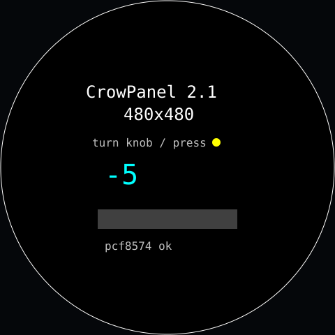

# hello — **built**



Smoke test for the board. Not an app, a check: when a real app draws wrong,
this tells you whether the board setup or your code is at fault.

Verifies six things at once:

- **PCF8574 expander** — LCD power, LCD reset and touch reset all live behind
  it, so if it doesn't ACK nothing else works. Serial says `pcf8574 OK`, and the
  screen says `pcf8574 ok` in grey (or `MISSING` in red).
- **RGB panel timing** — a 1px white circle of radius 239. If it touches the
  bezel all the way round, the porch and pixel-clock values in
  [`lib/board/board.h`](../../lib/board/board.h) are right. But the circle
  passing is not enough: with the pixel clock on the wrong edge the circle was
  fine and the **text** was noise. Look at the thin strokes. Wrong: flip
  `LCD_PCLK_NEG`; shifted or torn: lower `LCD_PCLK_HZ`.
- **Backlight PWM** — lit at the factory duty, 204/255.
- **Encoder** — the cyan number is detents since boot, decoded on interrupts,
  clockwise up. Serial prints `knob N` on every change.
- **Colour order** — the number is cyan and the touch dot is yellow on purpose:
  they swap if red and blue are crossed, which white, grey and green hide.
- **Knob switch** — the bar turns green while pressed (read through the
  expander, P5).
- **Touch** — a yellow dot follows the finger and vanishes on lift; serial
  prints `touch x,y`. The dot is a sprite that saves and restores the pixels
  under it, so dragging across the text does not punch holes in it.

Serial also prints `psram N KB free` at boot. The 460KB framebuffer comes out
of that; if it reads 0 the build lost `BOARD_HAS_PSRAM`.

```sh
pio run -e hello -t upload -t monitor
```

Verified on hardware 2026-09-15: expander OK, panel OK, 7737KB PSRAM free,
knob counts, press registers, touch traces cleanly across the whole face.

## Settings

Tunables live in [`data/config.json`](data/config.json) on the device, read via
the shared `appcfg.h` loader. Push a change without a rebuild:

```sh
./push-config hello
```

Every key is optional and the app runs on its compiled defaults with the file
absent. Out-of-range values are rejected and named on the serial log rather than
silently clamped. Credentials never go in here — see
[SECURITY.md](../../../SECURITY.md).
