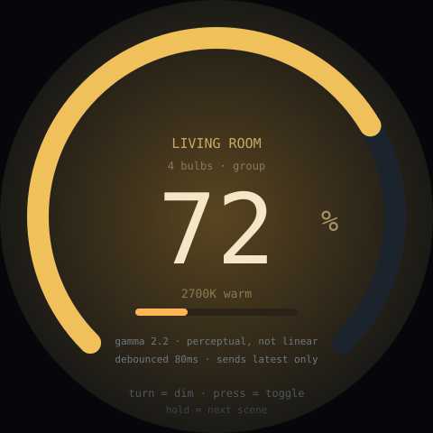

# light-dimmer — idea

Turn to dim, press to toggle, long-press to cycle scenes. The arc shows
brightness, the panel colour previews the bulb's actual colour temperature.

**Why this board:** dimming is the other canonical knob task. A wall or bedside
dial that controls smart bulbs is nicer than reaching for a phone, and unlike a
touch slider it works in the dark by feel.

**Hard parts**

- Talk to the *existing* smart-home system (MQTT / Home Assistant / Hue API) —
  don't put mains dimming hardware on a dev board. The bulbs already do it
  safely.
- **Perceived brightness is not linear.** A linear 0–100 mapping wastes most of
  the knob's travel at the bright end where the eye barely notices. Apply a
  gamma/logarithmic curve, and keep the exponent as a tunable constant.
- Latency kills the feel. Each encoder step firing its own network request will
  flood the bridge and lag visibly — debounce to ~50–100ms and send the latest
  value, not every intermediate one.
- State can change from elsewhere (phone, switch, automation). Subscribe to the
  bulb's reported state so the dial doesn't sit at a stale position.
- Multiple bulbs: decide whether the dial owns one light, a group, or has a
  selection mode. Group is simplest and usually what you want.

**Pieces:** LVGL arc, interrupt-driven encoder, `PubSubClient` for MQTT (or the
Hue REST API), `Preferences` for the target group.

**Effort:** small-medium. Mostly the same skeleton as
[thermostat](../thermostat/) — build whichever one you'd actually use, then the
other is a variation.
