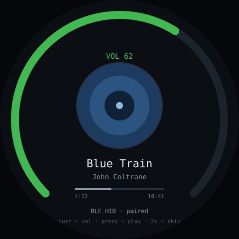

# media-knob — idea

A desk volume knob that also shows what's playing. Turn for volume, press for
play/pause, double-press to skip. Album art or a waveform fills the round panel.

**Why this board:** the knob makes this genuinely better than a keyboard
shortcut, and it's the app you'd use every single day. Round + album art is a
good visual match, and the ESP32-S3 supports BLE HID so the computer needs no
driver or companion app.

**Hard parts**

- **BLE HID consumer-control** is the clean approach: the OS sees a standard
  media remote, so volume works in every app with zero host software. Getting
  the HID descriptor right is the fiddly bit — start from a known-good consumer
  control descriptor rather than writing one.
- BLE reconnection after the host sleeps is the main annoyance. Test wake-from-
  sleep behaviour early; a knob that needs re-pairing daily gets abandoned.
- Showing *what's playing* needs host cooperation — BLE HID is output-only. Either
  accept a blind knob (still useful), or run a tiny helper on the desktop that
  pushes now-playing over Wi-Fi. The helper is the part that will rot.
- Volume from an encoder needs acceleration: slow turns fine-grained, fast turns
  coarse, or crossing the full range takes forever.

**Pieces:** `NimBLE-Arduino` (much lighter than the bundled BLE stack) with an
HID consumer-control descriptor, LVGL, optional desktop helper over HTTP.

**Effort:** small for the blind knob, medium with now-playing. Ship the blind
version first — it's most of the value.
