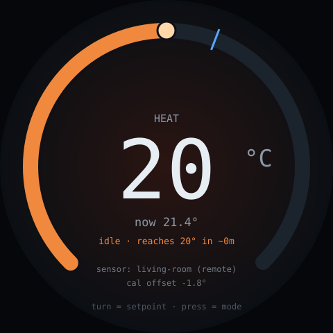

# thermostat — idea

The Nest dial. Big centred current temperature, an arc showing the setpoint,
turn the knob to adjust, press to switch mode (heat/cool/off). Colour shifts
warm or cool with the mode.

**Why this board:** this is the app the hardware was designed for — it's
literally the product photo. A round 480×480 panel with a detented encoder is
exactly a thermostat dial, and setting a target temperature is the canonical
one-dimensional adjustment that a knob beats a touchscreen at.

**Hard parts**

- **Controlling actual HVAC is out of scope for a dev board.** Make this a
  *front end* for an existing system — publish the setpoint to Home Assistant or
  an existing smart thermostat over MQTT and let that own the relays. Wiring a
  dev board to furnace control lines is a real-consequences job (and in many
  places a permitted one).
- Reading room temperature accurately is harder than it looks: the board's own
  heat dissipation warps any onboard sensor by several degrees. Use a remote
  sensor over the network, or an external probe on a short lead away from the
  PCB, and **leave a calibration offset constant** — you will need it.
- The setpoint arc must feel continuous while the encoder is detented. Interpolate
  the animation between steps, or it looks jerky at 26fps.
- Debounce the press so an adjust-then-press doesn't register a mode change.

**Pieces:** LVGL arc widget, interrupt-driven encoder decode, `PubSubClient` for
MQTT, a remote temperature source, `Preferences` for the setpoint across reboots.

**Effort:** medium. Build it against MQTT with a fake consumer first; the UI is
the fun part and it's the smaller half.
