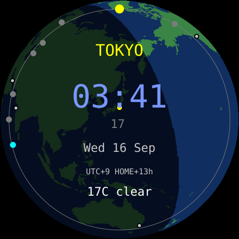

# world-clock — **built**



One city per screen. Turn the knob to move through the zones, press to jump
home. The ring of dots around the edge is every zone placed at its UTC offset
relative to the one on screen, 15° per hour, so the whole ring turns as you
do — the globe spinning under a fixed marker. Home is cyan, the selected zone
is the large yellow dot at the top.

The digits go cool blue when it is night *in that zone*, so 03:41 in Tokyo reads
as the middle of the night even when it is a Toronto afternoon.

- **Turn** — next / previous zone, wrapping.
- **Press** — back to home (zone 0).
- **Touch** — nothing. The knob is the interface.

## How it keeps time

NTP once over Wi-Fi, in UTC, and the RTC carries it from there. Each zone is
rendered by switching the C library's `TZ` to that zone's POSIX rule string and
asking `localtime_r`, so daylight-saving transitions are the rule's problem and
happen on the right day without a code change. The same format desk-clock's
`timezone` uses. A few to copy:

| City | `tz` |
|---|---|
| Toronto / New York | `EST5EDT,M3.2.0/2,M11.1.0/2` |
| Vancouver / LA | `PST8PDT,M3.2.0/2,M11.1.0/2` |
| London | `GMT0BST,M3.5.0/1,M10.5.0` |
| Paris / Berlin | `CET-1CEST,M3.5.0,M10.5.0/3` |
| Dubai | `<+04>-4` |
| Mumbai | `IST-5:30` |
| Tokyo | `JST-9` |
| Sydney | `AEST-10AEDT,M10.1.0,M4.1.0/3` |

Until the first sync the screen says `NO TIME` and whether it is still joining
Wi-Fi or waiting for NTP. If Wi-Fi drops later the clock keeps running on the
RTC and re-syncs when the link returns.

`selfCheck()` renders two fixed instants (one each side of DST) in every default
zone and asserts the hour, and checks the offset maths, the ring angle and the
centring helper. It runs at boot and halts the app loudly if any of it is wrong,
which is how a bad TZ string shows up as a message rather than a wrong clock.

```sh
pio run -e world-clock -t upload -t monitor
./push-config world-clock
```

## Settings

[`data/config.json`](data/config.json): the zone list (first is home, up to
16), 12/24 hour, day/night brightness, and the night window judged by home's
clock. Every key is optional; the defaults are the eight cities above with
Toronto home. Wi-Fi credentials are compiled in from `secrets.h` — see
[SECURITY.md](../../../SECURITY.md).
