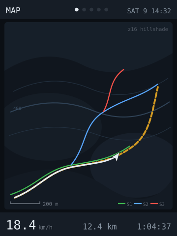
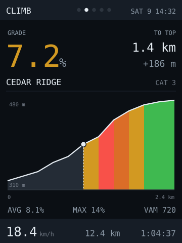
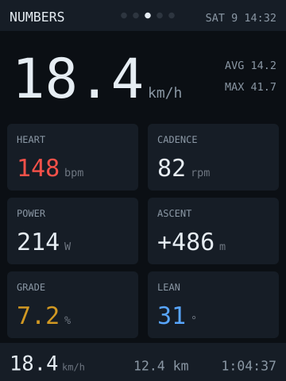

# bike-buddy — idea

A handlebar computer for mountain biking. **Five pages, one tap between them**:
an offline terrain map, the climb profile ahead, the numbers, the ride so far,
and what's connected. **No phone, no signal, no subscription** — which is the
point, because the trails worth riding have no cell service.

**Why this board:** the SD card is on **its own SPI bus**, so reading map tiles
doesn't stall the panel — the only board here where that's true, and this is the
app that needs it. 240×320 portrait gives a map viewport above a column of
numbers. The second core keeps NMEA parsing and BLE off the UI core. The
resistive touch is the *right* kind here: it responds to pressure, so it works
through winter gloves where capacitive wouldn't. And the LDR is a free ambient
light sensor for driving the backlight, which matters more than usual — see
[Readability](#readability-decides-whether-this-is-worth-building).

## The iPhone is the wrong source — leave it out

The obvious design is "phone does GPS and maps, board is a display". It doesn't
work, for a reason that isn't obvious until you look:

**iOS gives a generic BLE peripheral exactly three things** — ANCS
(notifications), AMS (media control), and the current time. There is no standard
service by which iOS publishes location, so **maps or GPS from the phone means
writing a custom iOS app**: Xcode, a developer account, the background-location
entitlement, and a 7-day expiry on free provisioning. That is a bigger project
than the firmware.

It's also the wrong dependency. A bike computer that goes blank because the
phone died in your pack, or because you left it in the car, is worse than no bike
computer. Every piece of data below is available without it.

## Everything worth showing is already open BLE, or a $12 module

| Data | Source | Protocol |
|---|---|---|
| Speed, distance, track, heading | GPS module (ATGM336H, NEO-M8N) | NMEA over UART — no BLE at all |
| Heart rate | Any chest strap | Standard GATT `0x180D` |
| Cadence, wheel speed | Any cheap magnet sensor | CSC `0x1816` |
| Power | Power meter, if you own one | CPS `0x1818` |
| Elevation, grade | BMP280 barometer, ~$3 | I²C |
| Lean angle, airtime, impacts | IMU (BMI270, LSM6DSO), ~$5 | I²C, same bus as the barometer |

Those GATT profiles are open standards — the board is a plain BLE **central** and
every mainstream strap and sensor speaks them. No pairing UX to design beyond
"remember these MACs", and no vendor cloud in the path.

**Add the barometer.** GPS altitude is the worst number GPS produces — ±10–20m,
and it wanders while you stand still, which makes both total ascent and live
grade useless. A $3 BMP280 gives relative elevation an order of magnitude better.
It needs a reference: zero it at the trailhead, or set sea-level pressure, and
expose that as config rather than a constant, because it drifts with the weather
over a day.

**Take speed from the wheel sensor when it's there, GPS when it isn't.** GPS
speed lags a second or two and gets noisy under tree canopy — exactly the
conditions you'll ride in. A CSC wheel sensor is instant and accurate, but only
if the wheel circumference is right, so that is a config value in mm and not a
`#define` buried in the source. Measure it by rolling the bike, don't trust the
tyre's printed size.

## The car g-meter does not survive the move to a bike

A Sport Chrono g-meter works in a car because **the car stays level** — the
sensor's frame is the car's frame, so lateral acceleration shows up as lateral
acceleration. Bolt the same IMU to a bike and the display goes dead in exactly
the corner you built it for: **a bike leans until the net force lies in its own
plane**, so a frame-mounted accelerometer reads lateral ≈ 0 through the best turn
of the ride. Port the g-meter and you get a needle that sits still when it should
be pegged.

The bike's equivalent of that number is **lean angle**, and the lazy way to get
it is also the correct one — **no fusion filter at all**:

> In a steady turn of radius `r`, yaw rate `ω = v / r` and lateral acceleration
> is `v² / r`, which is just `v · ω`. So **`lean = atan(v · ω / g)`** — one gyro
> axis and the speed you already have.

That matters because the obvious alternative is wrong where it counts. Deriving
lean from the accelerometer with a complementary filter needs gravity as a
reference, and sustained cornering is precisely when the accelerometer stops
being able to tell you which way gravity is. Speed × yaw rate has no such
failure: it's most accurate in a sustained turn, which is the only time anyone
looks.

It also means **don't buy a fusion chip.** A BNO085 computes absolute orientation
on-board for ~$30 and saves you filter maths you now don't have to write. A
$5 BMI270 or LSM6DSO on the same I²C bus as the barometer — different address, no
extra wiring — is the whole bill of materials.

What the accelerometer *is* good for on a bike, none of which a car cares about:

- **Airtime.** Freefall is unmistakable: total acceleration magnitude near zero.
  Under ~0.3g for more than ~100ms is a jump, and the duration is the number
  everyone wants. Suspension mutes the first few milliseconds, so measure from
  the threshold crossing, not from the takeoff you think you felt.
- **Landing and impact peaks**, to mark the log where something interesting
  happened.
- **A roughness index** — accelerometer variance over a rolling window, which is
  a decent proxy for how chunky a section of trail is.

**Don't present impact detection as crash detection.** There's no connectivity on
this device to call anyone with, so it flags the ride log and nothing more.
Anything sold as a safety feature has to actually be one.

Two gotchas that bite regardless of chip:

- **Vibration will eat your peaks.** You need a low-pass filter to get a number
  that doesn't jitter on screen — but compute **peak-hold on the unfiltered
  stream**, or the filter removes the very spike you were trying to catch.
- **Mount alignment is a calibration value, not a constant.** The board will not
  sit square to the bike. Capture the gravity vector once at rest on level
  ground, store the rotation, and apply it — otherwise every axis is a few
  degrees of somebody else's.

And one board constraint: **free GPIO on the CYD is scarce and the pinout here is
still unverified community data.** The barometer and the IMU sharing one I²C bus
is what makes this affordable in pins at all — confirm the bus before committing
to either.

## Terrain, not street maps — and render it, don't download it

A street tile is the wrong map for a bike that never touches a street. But
**off-the-shelf topo tiles are just as wrong**, for a reason worth being precise
about: OpenTopoMap and friends are styled for a 6-inch phone at 400dpi — contours
every 10m, hairline strokes, labels on everything. Scale that onto 240px of
backlit LCD, read in a one-second glance through sunglasses, and it is grey mush.
You are not zooming and you are not panning. You get one glance.

So render three layers, each of which survives being small:

1. **Hillshade as the base.** A grayscale relief raster reads as terrain shape
   even tiny — you see the ridge and the gully without a single line being drawn.
   It is the cheapest terrain cue per pixel that exists.
2. **Index contours only**, every 50m or 100m. You want "how steep is this side
   of the valley", not a survey.
3. **Trails from OSM, coloured by `mtb:scale`.** This is the layer that makes it
   a *mountain bike* map. OSM already carries `highway=path`, `mtb:scale` (0–6),
   `surface` and `trail_visibility` — render green/blue/red by difficulty and drop
   everything that isn't rideable. **A map with four trails on it beats a map with
   forty roads.**

**Render locally rather than downloading**, for two independent reasons. Tile
servers' usage policies forbid bulk downloading — OSM's explicitly, and
OpenTopoMap is a small volunteer server you would simply be stealing from. But
the stronger reason is that **the styling is the entire point and you cannot
restyle someone else's PNG.** A Geofabrik extract for your region plus a
Copernicus GLO-30 or SRTM DEM, run through `gdaldem hillshade`, `gdal_contour`
and a trail style, gives you tiles drawn *for* 240px. That's a prep script on the
Mac, run once per riding area — the firmware stays a blitter.

The device side is unchanged and cheap: at zoom 16 a tile covers roughly 400m at
mid-latitudes, so a 10km square is about 500 tiles, **~10MB as JPEG**. Use JPEG,
not PNG: `JPEGDEC` decodes MCU blocks **straight to the display**, which is the
only workable path on a board with 520KB and no PSRAM. You cannot hold a 3×3 tile
neighbourhood in RAM — you decode into the viewport, clipped, and never buffer
the map.

## The climb profile is the terrain feature that gets used

The map is what you look at when you stop. **The profile is what you look at
while riding**, and it's the feature people actually rave about on a Wahoo
(Climber) or a Garmin (ClimbPro): *how much of this climb is left.*

It is also nearly free, because **it needs no tiles at all.**

During prep, sample the DEM along the route every ~25m and write `route.prof` —
distance/elevation pairs, nothing else. A 30km route is about 1200 points, **under
5KB**. From that one small file the firmware gets the profile ahead, distance and
ascent remaining to the top, average grade of what's left, and where on the climb
you are — with no map pipeline in sight.

**Precompute the climbs on the host.** Finding sustained gradient segments,
merging them across dips and categorising them is fiddly analysis full of
thresholds you'll tune by eye. Do it in Python on the Mac and ship a list of
`(start, end, gain, average grade, name)`. That is the same split the
[C6 ticker](../../../esp32-c6-lcd-1.47/apps/ticker/) uses for logos — the decision
happens where there is full information and a real language, and the firmware
just draws the answer. It costs the firmware nothing and it is the whole
difference between "a profile" and a climb page.

**Don't take the profile from GPX elevation or from the barometer.** GPX `<ele>`
is frequently garbage — phone barometers, bad interpolation, or simply absent.
The DEM is consistent and you control the sampling. The barometer keeps the job
it's good at, and the division is clean:

> **DEM = what's ahead. Barometer = where you are.** Planned versus live. Neither
> can do the other's job.

## Pages

Five, and one gesture.

| Page | What it shows |
|---|---|
| **MAP** | Hillshade, trails by difficulty, planned route, your track, position and heading |
| **CLIMB** | Profile ahead coloured by grade, distance and ascent to the top, live grade large, VAM |
| **NUMBERS** | Big speed, then heart rate, cadence, power, ascent, grade and lean |
| **TRIP** | The ride so far: moving vs elapsed, average and max, total ascent and descent, airtime, laps |
| **SYSTEM** | Sats and HDOP, each sensor's link **and its own battery** (straps report BAS `0x180F`), card space, free heap, die temp |

The header carries page dots, sats and the clock; the footer carries speed,
distance and elapsed time on *every* page — those three are the numbers you never
want to have to go and find.

Navigation rules, all of them consequences of "you are on rough ground":

- **Tap anywhere for the next page.** The whole screen is the target, because
  there is nothing you can reliably aim at. The dots say where you are.
- **Auto-switch to CLIMB when a climb starts**, and back when it tops out. This
  is free — the climbs are already precomputed. Config flag, default on.
- **Auto-return to the default page** after ~30s on SYSTEM or TRIP, so you don't
  descend a mountain looking at your free heap.
- **Five is the cap.** Single-direction cycling means five pages is at most four
  taps to anywhere. A sixth page is a real cost, not a free addition.

## Readability decides whether this is worth building

**Test this before writing a line of code.** Garmin and Wahoo use transflective
MIP displays for one reason: a backlit IPS panel washes out in direct sun, and a
bike computer is a daylight device. Take the CYD outside at noon and look at it.
If it's unreadable, the project is a garage-trainer toy and you should know that
on day one rather than after the enclosure.

Two things to try if it's marginal:

- **Invert the scheme.** Every other app in this repo is light-on-dark and the
  preview here follows that, but outdoors dark-on-light often wins — ambient
  light reflecting off a bright background works *with* you instead of against
  the backlight.
- **Drive the backlight from the LDR,** full brightness in sun. Power is not
  scarce here (see below), so there is no reason to ever dim it outdoors.

## Power: external bank, and that has consequences

Rough budget, to be measured rather than trusted:

| | |
|---|---|
| ESP32 + BLE connected, Wi-Fi off | ~50–80 mA |
| Backlight, full | ~40–60 mA |
| GPS, continuous tracking | ~25–45 mA |
| **Total** | **~120–180 mA @ 5V (≈0.7–0.9 W)** |

A 5000mAh bank is ~18.5Wh, about 16Wh after boost losses — **roughly 20 hours**.
Runtime is a non-problem; a credit-card 3000mAh bank triples your longest ride.
Mount it in a top-tube bag so the cable run is short and nothing crosses the
steerer to snag in a crash.

Three consequences of the bank that are easy to miss:

- **Solder the cable to the `5V`/`GND` pins.** A USB connector on a mountain bike
  is the single most likely failure of the whole device — vibration makes it
  intermittent, an intermittent reboots the ESP32, and a reboot costs you the
  ride log. Remove the connector from the problem. This also satisfies the
  board's own warning about needing a proper 5V supply rather than a weak port.
- **Never add a sleep or dim mode without checking the bank.** Most power banks
  cut their output below ~50–70mA. At 120–180mA you're clear, but the moment you
  "save power" you cross the threshold and the bank switches off mid-ride.
- **There is no battery percentage to display.** A dumb bank exposes no state of
  charge, so the UI simply cannot have a battery indicator — which is why the
  preview shows satellites and clock time in that corner instead. Don't design a
  gauge you can't feed.

## Settings, and why half of them are calibration

Everything tunable lives in [`data/config.json`](data/config.json), read through
the shared [`appcfg.h`](../../../esp32-c6-lcd-1.47/lib/board/appcfg.h) loader —
same convention as every app on the C6, so a change applies without a rebuild,
bad values are rejected and named on the serial log rather than silently clamped,
and the file documents itself in `_`-prefixed blocks.

**This app has no `secrets.h` at all.** No Wi-Fi, no API keys, nothing to keep
out of a plain-text file on a dumpable filesystem. That falls straight out of
leaving the phone and the network out of the design.

| Key | What |
|---|---|
| `wheel.circumferenceMm` | **Measure it by rolling the bike.** Every distance scales off this |
| `speed.source` | `auto` prefers the wheel sensor, falls back to GPS under canopy |
| `barometer.zeroAtStart` / `.seaLevelHpa` / `.gradeWindowM` | Elevation reference and how far grade is averaged over |
| `sensors.heartRate` / `.cadence` / `.power` | BLE MACs; empty means not fitted, and the field doesn't draw |
| `imu.enabled` / `.airtimeG` / `.airtimeMs` | Freefall thresholds for jump detection |
| `pages.default` / `.autoClimb` / `.returnSeconds` | Which page, auto-switch to CLIMB, auto-return |
| `autopause.pauseBelowKph` / `.resumeAboveKph` / `.dwellMs` | The hysteresis pair, not one threshold |
| `route.gpx` / `.prof` / `.offRouteM` | The route, the profile, and when to admit you've left it |
| `map.tileDir` / `.zoom` | Where the rendered tiles live |
| `brightness.auto` / `.min` / `.max` | LDR bounds — note the **high floor**, this is a daylight device |
| `log.flushSeconds` | How often the append-only track log hits the card |

The split worth noticing: **`wheel.circumferenceMm`, `barometer.seaLevelHpa` and
the autopause pair are not preferences, they're calibration.** A bike computer
that can't be matched to the actual bike reports confident wrong numbers, which
is worse than reporting none — the tyre sidewall's printed size is off by a
couple of percent once you account for width, pressure and rider weight, and a
couple of percent is a wrong distance on every ride you ever record.

**Hard parts**

- **Vibration kills dev-board wiring.** Headers and jumper wires will not survive
  a season. Solder everything, strain-relieve every lead, and pack the board in
  foam inside the case.
- **Brown-out corrupts the card, not just the log.** Losing power mid-write can
  take the filesystem down with it. Append the track one line per fix and flush
  every few seconds instead of holding a file open — a truncated log is then
  still a valid partial ride.
- **GPS under canopy is mediocre and you can't fix it in software.** Expect
  dropouts on wooded singletrack. Hold the last known position and *say* it's
  stale rather than drawing a confident wrong dot — the same rule the rest of
  this repo follows for dead sensors.
- **Auto-pause needs hysteresis.** A single speed threshold flickers between
  moving and stopped on a slow technical climb and ruins the moving-average.
  Two thresholds and a few seconds of dwell.
- **Design for no input at all.** You cannot aim at a screen on rough ground.
  One page-cycle action on a huge target — ideally the whole screen — not a grid
  of buttons. Resistive touch through gloves is the advantage; precision is not.
- **Tile edges are where the bugs live.** Crossing a boundary at speed, at the
  corner where four tiles meet, with a missing tile for an area you didn't
  prepare. Draw a blank tile deliberately rather than letting a failed read
  render garbage.
- **Sample the profile by distance, not by point index.** GPX points cluster
  where you were slow and thin out where you were fast, so plotting by index
  stretches the technical bits and compresses the fireroad — a profile whose
  shape is a lie. Resample to even distance during prep, where it's one line of
  Python.
- **"Distance to top" is meaningless off-route.** Snap position to the nearest
  route point with a distance threshold, and past that threshold say **OFF
  ROUTE** rather than counting down to a summit you're no longer riding towards.
  A confident wrong number is the failure mode this whole repo keeps guarding
  against.
- **Auto-page must not fight the rider.** If they tapped away from CLIMB, leave
  them where they put themselves for the rest of that climb. Automatic help that
  overrides a deliberate action stops being help.

**Pieces:** `TinyGPSPlus` for NMEA, `NimBLE-Arduino` as a multi-connection
central, `JPEGDEC` for tiles (already the choice in
[sd-file-browser](../sd-file-browser/)), `SdFat`, `Adafruit_BMP280`, an IMU
driver, TFT_eSPI, `XPT2046_Touchscreen`, and a host-side prep script built on
GDAL (`gdaldem hillshade`, `gdal_contour`) plus a DEM sampler that emits
`route.prof` and the climb list.

**Effort:** large — the biggest app in this repo, and the only one combining a
UART sensor, multi-device BLE, SD rendering and a write path. **Split it, and the
split is better than it looks:**

- **v1 — no tiles at all.** GPS, strap, barometer, the NUMBERS and TRIP and
  SYSTEM pages, an append-only track log, and **the CLIMB page**, which needs
  only `route.prof` and a polyline. Plus a bare breadcrumb line where MAP will
  go. That is most of the value of the device, it includes the terrain feature
  riders care about most, and it carries none of the tile pipeline.
- **v2 — the rendered map.** GDAL prep, JPEG tiles, the MAP page proper.

v1 is also the version that answers the two questions that actually decide this
project: does the screen survive direct sun, and does the wiring survive a trail.
Don't build the tile renderer before you know.
