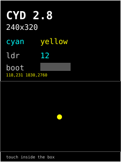

# hello — **built**



Smoke test for the board. Not an app, a check: when a real app draws wrong,
this tells you whether the board setup or your code is at fault.

Verifies seven things at once:

- **Panel driver and offsets** — a 1px white frame at the very edge. If it
  touches the bezel on all four sides, the ILI9341 setup in
  [`lib/board/board.h`](../../lib/board/board.h) is right. Washed-out white
  with the right shapes means the two-USB ST7789 revision: set `LCD_ST7789 1`.
- **Colour order** — the words `cyan` and `yellow` are drawn in those colours
  on purpose: they swap if red and blue are crossed, which white and green hide.
- **Backlight PWM** — lit at the config duty (255 by default).
- **Touch** — a yellow dot follows the stylus inside the grey box; the line
  above shows screen and raw coordinates and serial prints `touch x,y raw a,b`.
  If the dot lags the stylus toward one corner, tune `touch.*` in
  `data/config.json` (raw values at the screen edges) and `./push-config hello`.
- **RGB LED** — walks red, green, blue, off, one step per tick, so a stuck or
  miswired channel is obvious.
- **LDR** — the cyan number, re-read every tick. Cover the sensor and it should
  climb; in room light it sits near 0.
- **BOOT button** — the bar turns green while held. Also the speaker header:
  every touch-down plays a 40ms 880Hz click if a speaker is fitted.

Serial also prints `panel OK, heap N KB free` at boot, and `tick` lines.

```sh
pio run -e hello -t upload -t monitor
./push-config hello        # config.json only, no rebuild
```

## Settings

Tunables live in [`data/config.json`](data/config.json) on the device, read via
the shared `appcfg.h` loader. Every key is optional and the app runs on its
compiled defaults with the file absent. Out-of-range values are rejected and
named on the serial log rather than silently clamped. Credentials never go in
here — see [SECURITY.md](../../../SECURITY.md).
