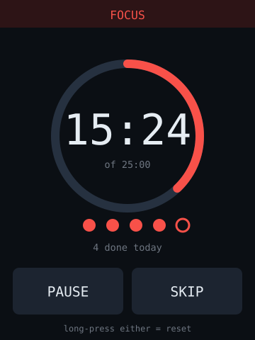

# pomodoro — idea

25/5 work timer. Big countdown, tap to start/pause, long-press to reset, chime
on transitions, and a session counter for the day.

**Why this board:** the one app that needs all three of this board's extras —
touch to control, speaker to signal, and the RGB LED as a room-visible state
indicator (red = focus, green = break). No network required at all, so it works
before Wi-Fi is even configured.

**Hard parts**

- Nothing hard, which is why it's the right *first* app for this board. It
  exercises touch and audio without any network or protocol work.
- Use `millis()` deltas, not accumulated `delay()`, or the timer drifts.
- The speaker header is a bare pin driving a small speaker — no amp, no DAC
  quality. Use `tone()`-style square waves or a short PCM sample; don't plan on
  music.
- Long-press-to-reset needs a press-duration state machine, not just a
  touch-down event, or you'll reset by accident constantly.

**Pieces:** TFT_eSPI or LVGL, `XPT2046_Touchscreen`, `ledc` for the buzzer,
`Preferences` to persist the daily count across reboots.

**Effort:** small. Build this first on this board.
