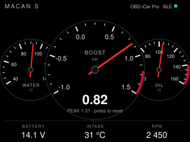

# porsche-gauge — idea

The [Porsche notes](../../../porsche/README.md) made the case for starting
with a BLE ELM327 dongle and standard PIDs. This is that app, on the board
that suits it best: the CYD has BLE on chip, a second core so the BLE client
never stalls the needles, runs off the 12V socket over USB, and is cheap
enough to live in the car. Landscape, 320×240.

**No shield, no wiring.** The board talks to a dongle in the OBD-II port over
BLE. A CAN shield with its own transceiver only makes sense for a bare devkit
and only if the dongle's latency turns out to annoy you; the CYD's spare pins
(GPIO 22 and 27 on the CN1 connector) could take an SN65HVD230 later, but
that is a second version, not the first.

## Pages

| Page | What |
|---|---|
| **Cluster** | Boost in the centre (MAP − ambient, peak-hold, tap to reset), water and oil temperature tucked behind it the way the real dash overlaps its dials. Battery, intake temperature and RPM along the bottom. |
| **Warm-up** | One ring that closes as oil reaches 80 °C, with the RPM ceiling to hold until it does. The useful page for a turbo engine on a cold morning. |
| **Battery** | Rest voltage, cranking dip, charging voltage. The Macan's biggest owner complaint is 12V drain. |

Tap anywhere to page. Red zones and the peak marker are drawn from config so
a 911 and a Macan get their own scales without a rebuild.

## PIDs

All standard mode 01: `0B` MAP, `33` barometric (or `46` ambient), `05`
coolant, `5C` oil (*unverified on Porsche ECUs*), `42` module voltage, `0F`
intake temp, `0C` RPM. Query `00` first and grey out anything the car does
not answer rather than showing zeros.

## Hard parts

- **Read-only, always.** Requests only; never a write to a module.
- The dongle: BLE, not classic Bluetooth. Vgate iCar Pro BLE 4.0 is the one
  that comes up as reliable with ESP32 clients; the $8 clones fake their ELM
  version and drop frames. Unplug it when parked.
- ELM327 over BLE is a line-oriented text protocol at a few requests per
  100ms. Round-robin the PIDs, boost fastest, temperatures slowest.
- Needles: redraw only the wedge between the old and new angle, or the whole
  dial flickers at 10Hz on an SPI panel. Compose each dial in a small canvas.
- Resistive touch in a moving car wants one target: the whole screen.
