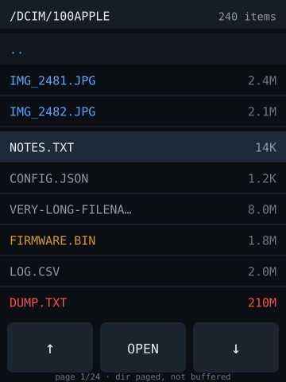

# sd-file-browser — idea

Scrollable list of files on the SD card, tap to open: text files render as text,
images render as images, everything else shows size and a hex preview.

**Why this board:** touch makes navigation actually pleasant, and the card is on
a separate SPI bus so reading doesn't stall the display. Mostly this is a
*utility* — a way to see what's on a card without pulling it and finding an
adapter.

**Hard parts**

- Don't read the directory into RAM. Page it — hold one screenful of entries and
  re-read on scroll — or a card with a few thousand files exhausts heap.
- Long filenames need truncation, and SD's 8.3 vs. long-name handling varies by
  library (`SdFat` is better than `SD` here).
- Touch scrolling on a resistive panel is imprecise. Prefer page-up/page-down
  buttons over kinetic scrolling; flick gestures will frustrate.
- Guard the file viewer: a 2MB text file opened naively will hang or crash. Cap
  the read to a screenful and page through.

**Pieces:** `SdFat`, TFT_eSPI or LVGL, `XPT2046_Touchscreen`, `JPEGDEC` if you
want image preview.

**Effort:** small-medium. Good second app — reuses the touch list rendering that
`touch-dashboard` needs.
