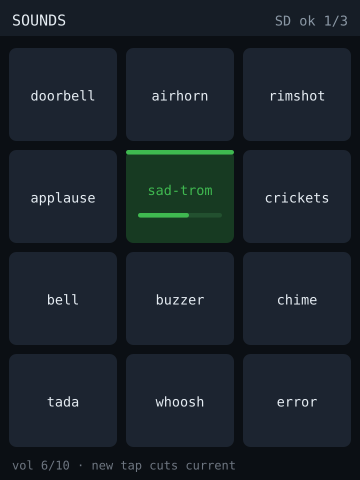

# soundboard — idea

Grid of labelled buttons; tap one and it plays the matching WAV off the SD card
through the speaker header. Sound effects, doorbell chimes, a desk bell, whatever.

**Why this board:** it is the only board in the collection with audio output and
touch together, and the SD slot is on its own SPI bus here (unlike the C6), so
streaming audio doesn't fight the display for the bus.

**Hard parts**

- Audio out is a bare GPIO into a small speaker — no I2S DAC, no amplifier.
  Expect 8-bit-ish quality at low volume. Pre-convert samples to 8-bit mono
  8–16kHz WAV on the computer; don't decode MP3 on-device.
- Playback must not block the UI. Feed samples from a timer interrupt or a
  dedicated task on the second core, or every tap freezes the screen for the
  length of the clip.
- Decide the overlap policy: does a new tap cut off the current sound or queue
  behind it? Cutting off feels better for a soundboard.
- Label the buttons from a manifest file on the card, not from code, so adding a
  sound doesn't mean a re-flash.

**Pieces:** `SD`, `ESP8266Audio` (works on ESP32, has a no-DAC output class) or a
hand-rolled `ledc`/timer PCM feeder, `XPT2046_Touchscreen`.

**Effort:** medium. Audio-without-blocking is the interesting part; the grid is
trivial.
