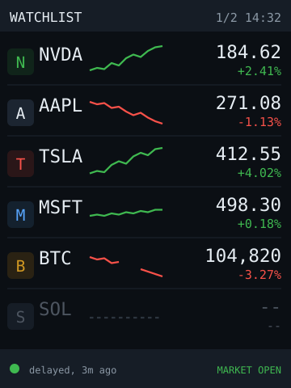
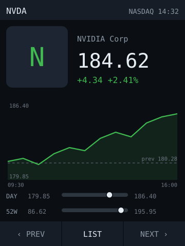
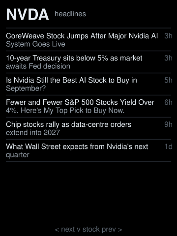
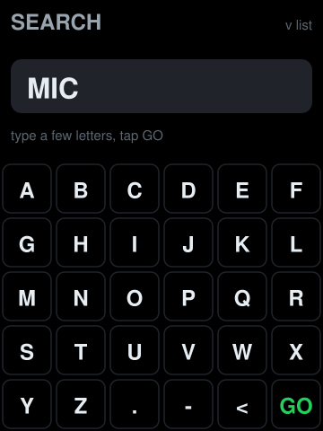
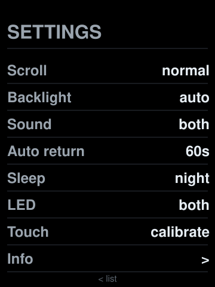
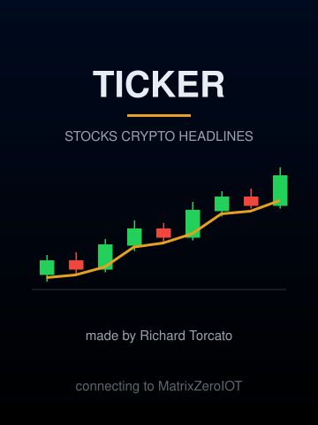

# ticker — **built** (list + detail + logos)

Built 2026-09-15, first version: the LIST layout with a sparkline on every
row, tap a row for the stock's own page (chart with previous-close line, day
and 52-week range bars), fetches on core 0,
brightness from the LDR. 2026-09-16: logos at two sizes from LittleFS; the
list became a **continuously scrolling ring** (hardware scroll, seven rows,
no pages, no footer); a range selector (1D / 5D / 1M / 6M / 1Y) under the
detail chart, prefetched so a tap is instant; **market sessions** (nothing is
fetched while the market is closed, the header says CLOSED and when it
opens, the detail page shows the after-hours price); a SETTINGS page a swipe right
away, with an INFO page in it. **Not built yet:** the SD card, the HEATMAP layout,
and the NVS layout memory -- the design below is the roadmap for those.

## The list scrolls, it doesn't page

The ILI9341 scrolls in hardware: `VSCRDEF` (0x33) fences the seven row slots
between the fixed 22px header and the bottom edge, `VSCRSADD` (0x37) says
which line of that region shows at the top, and the region wraps. Moving the
whole list one pixel is one two-byte command, so the crawl costs nothing to
draw. `timing.pageSeconds` is now how long one screen (seven rows) takes to
pass; 10 reads well.

The catch is that between row boundaries the top row and the row entering at
the bottom share **one** slot (they are seven virtual rows apart and the ring
has seven slots): the top row owns the slot's lower lines, the entering row
its upper lines. So the entering row is painted off-screen into a one-row
`Arduino_Canvas` (20KB) and its lines are fed into the slot as the scroll
brings them into view -- forward that is the row below, from the top of the
slot down; backward it is the row above, from the bottom up; the canvas is
repainted on a reversal. The list is modelled as an endless strip of virtual
rows over one signed pixel position, so it scrolls either way and wraps, and
`hitRow()` maps a touch through it. Rows fully in the ring update in place
when their price changes; the shared slot waits for the boundary. A list
shorter than seven simply repeats. The board's `boardBus()` exists so an app
can send the two panel commands Arduino_GFX has no API for.

**A finger drives it too.** Drag up or down and the list follows; the crawl
pauses while a finger is down and for three seconds after, so a drag or a
press is never fought. A still finger highlights its row at once and **opens
the stock when it lifts** -- touch-up, the way a phone list works, so it is
as quick as the lift itself and a drag can still start anywhere on a row.

**Touch calibration** is a settings row. Three targets (top-left, top-right,
bottom-left); which chip axis moved between the first two says whether the
panel's axes are swapped relative to the screen, the sign says whether one
is mirrored, and extrapolating to the edges gives the ranges. Which axis the
film calls X is a wiring fact, not a convention, and every "the swipe does
nothing" report is consistent with getting it wrong -- so it is measured, and
the result lives in NVS. Run it first if any gesture feels wrong.

**Four kinds of row.** `stocks`, `indices` (Yahoo ids like `^GSPC` with a
label of your own: S&P, NDQ, DOW, TSX), `currencies` (ISO codes; a row is
how many of it one US dollar buys, `CAD=X` underneath) and `coins`. The
first three go through Yahoo and share the sweep; the sparkline, the chart
and the headlines work for all of them. Forty rows across the four.

**A display currency.** The Currency row in settings cycles USD and every
code the `currencies` list carries. Every price -- list, tile, page, ranges,
chart labels -- converts through those rows' live rates: native to USD by
the quote's own currency (Yahoo says which; BNS.TO is CAD), USD to the
display currency. The page prints the code beside the price whenever it is
not plain USD. A row whose rate is missing shows its own currency and says
so. FX rates themselves never convert. Alert lines stay in the quote's
native currency.

**Search and add, swipe left from the heatmap.** Symbols are short and
upper-case, so the keyboard is a 6×5 grid of 40px keys: A–X, then Y Z . -
backspace GO. Type a few letters (symbol or company name), tap GO, and
Yahoo's keyless lookup (`query1.finance.yahoo.com/v1/finance/search`) returns
up to six matches, futures and options filtered out. Tap one and it is
**added to the list and its page opens** -- there is no "just look" mode,
because a look you don't keep is one long press away from gone. Added
symbols are Yahoo symbols and travel the stock path (BTC-USD included; its
label drops the `-USD`). They have no logo file, so the badge and the big
square draw a tile with the initial instead; run `make-logos.py` after
adding them to `config.json` if you want the real mark.

**Remove, long press on a stock's page.** The hint line turns amber -- "tap
here to remove NVDA" -- and a tap on it within five seconds does it. Anything
else lets it lapse.

**Edits live in NVS, over config.json.** Two comma lists, `add` and `del`,
applied after the file loads, so a config push never undoes a tap. Adding a
symbol the file lists takes it off `del`; removing an added one takes it off
`add`. Stocks stay ahead of coins in memory because the sweep counts on it,
and an in-flight fetch that finds the rows moved under it drops its result
rather than storing a price on the wrong row. Remove the last symbol and the
NO LIST panel offers the search.

**Headlines, swipe up from a stock.** Yahoo's per-symbol RSS
(`feeds.finance.yahoo.com/rss/2.0/headline?s=NVDA`), keyless, ~12KB, parsed
with `strstr` -- six titles with their age, word-wrapped to two measured
lines. Cached ten minutes per symbol. Swipe left / right for the next /
previous stock's headlines, down for the stock.

## Market sessions

The trading day has four parts from the clock and `market.*`: pre-market
(04:00), regular (09:30-16:00), after hours (to 20:00), closed. Fetch policy
follows it: `refresh.openMinutes` in the regular session,
`refresh.extendedMinutes` in pre/post, and when closed **one sweep after the
close** to keep the final after-hours prints, then nothing until the next
pre-market. Crypto never closes and keeps its own interval. Tapping a row
while closed does not refetch it either.

**Holidays come from the quotes, not a calendar.** Yahoo's
`regularMarketTime` is the last regular-session trade. On a weekday a quarter
hour past the open, if every stock's last trade is from an earlier day,
nothing is trading today: the header says CLOSED, the sweep stops, sleep on
`closed` applies. Pre-market on a holiday cannot be told from a normal one
(yesterday's trade is normal then) and costs a few extended-hours fetches.

Quotes are requested with `includePrePost=true`, so the 1D series runs
04:00-20:00 and the row keeps its newest bar as `last`. The list always shows
the regular-session figures. The detail page, outside the regular session,
shows `last` as the price with its move measured from the regular close and
says "after hours" / "pre-market" where the company name goes. The header
says nothing while the market is open ("market open" is not news) and
`CLOSED til Mon 09:30` when it is.

```sh
python3 tools/make-logos.py --size 24 --out data/logo/24   # once, on the Mac
python3 tools/make-logos.py --size 96 --out data/logo/96
pio run -e ticker -t upload -t monitor
./push-config ticker                                        # config + logos
```

Verified 2026-09-16: `logos 24px: 26/26 present`, `logos 96px: 26/26 present`
on the boot log, ~162KB heap free after the first coin fetch.











The [C6 ticker](../../../esp32-c6-lcd-1.47/apps/ticker/), ported to a screen with
40% more width and a finger on it. Same watchlist, same keyless APIs, same
one-palette rule, **same logos** — but every row carries a logo badge and a
sparkline, there's a twelve-symbol heatmap the C6 can't hold, and **tapping a
stock opens that stock's own page** instead of cycling blind through the list
with one button.

The port is worth doing because four separate C6 compromises were all forced by
that board, and none of them apply here.

## The sparkline is already paid for

This is the headline, and it costs **nothing**.

The C6 calls Yahoo's v8 chart endpoint with `range=1d&interval=1d`, reads
`meta.regularMarketPrice` and `meta.chartPreviousClose`, and throws the rest
away. Ask the *same endpoint*, at the *same one request per symbol*, for
`range=1d&interval=5m` and the response carries **roughly 78 intraday closes**
in `indicators.quote[0].close`. Same rate-limit cost, same request count, same
TLS session — the C6 just had no width to draw a chart in and never asked for
the series.

240px does have the width: symbol, a 70px sparkline, price and change all fit one
42px row, six rows to a page.

**The payload grows about tenfold**, from ~1.3KB to ~10–15KB, and that is the one
change that can take the heap down. Parse it with an **ArduinoJson streaming
filter** over `indicators.quote[0].close` and `meta` only, straight into a
`float[78]` — 312 bytes retained per symbol, and the document never lives in RAM
whole. Don't `deserializeJson()` the response and then pick fields out of it;
that's the version that runs fine on twelve symbols and dies on twenty-six.

## Four C6 compromises that don't apply here

| C6 limit | What it forced | On this board |
|---|---|---|
| 172px wide | Six rows of symbol/price/change, no room for anything else | A sparkline column, and a 3×4 heatmap |
| One button, no touch | Blind cycling: hold 2s for the next layout, no way to pick a symbol | **Tap the row you want** |
| Single core | 22 blocking requests froze `loop()` for ~26s; fixed by fetching one per pass | Fetch task on core 0, UI on core 1 |
| 896KB data partition | 26 logos at 96px = 479KB, **52% of the partition** | SD card on its own bus: 128px logos, 32 of them, ~1MB, nobody cares |

**Dual-core is a real fix, not a bigger workaround.** The C6's one-request-per-pass
design exists so the clock keeps ticking and a button press doesn't land half a
minute late. Put the fetch loop in its own task pinned to core 0 and the UI never
stalls at all. But **do not let two cores tempt you into parallel TLS** — each
`NetworkClientSecure` session is ~40KB of a 520KB heap and this board has no
PSRAM either, so fetches stay strictly sequential. The rate floor stays too:
`stockEvery = max(interval, nStocks × 60s)`, because Yahoo's 429 doesn't care how
many cores you have.

**Touch earns its keep here specifically.** Resistive is bad at flicks and
useless for pinch, which is why `touch-dashboard` and `sd-file-browser` both
design around it — but "tap one of six 240×42 rows" is exactly what it's good at.
Tap a row for the detail view, tap the header to change layout, tap anywhere to
come back. That replaces a one-button gesture vocabulary that had to spend its
colour-scheme gesture on layout switching just to fit.

## Three layouts

| Layout | What it shows |
|---|---|
| **LIST** | A scrolling ring of seven rows: badge, symbol, intraday sparkline, price, signed change. One SECTION at a time -- all, stocks, indices, crypto, currencies -- a tap on the header cycles them. |
| **HEATMAP** | Swipe left. 3×4 grid of 78×62 tiles of the current section, each tinted by the size of its move, pages of twelve. Tap a tile for the stock. Swipe left again for search. |
| **DETAIL** | One stock's own page — logo, chart, ranges, headlines a swipe up. Reached by lifting a finger off its row. |

Heatmap tint is **intensity, not just sign** — a 0.2% drift and a 9% drop must
not look the same. Bucket the magnitude and keep the signed percentage printed on
every tile, because colour is never allowed to be the only cue (the C6 build
settled that already).

## Logos, at two sizes

Two sizes, **both prepared on the host** and shipped raw on LittleFS:

| File | Size | Used by |
|---|---|---|
| `/logo/96/NVDA.565` | 18KB | The stock's own page |
| `/logo/24/NVDA.565` | 1.1KB | The badge on each list row |

**96 on the detail page, not the 128 this section first planned.** 128px is
32KB a logo; 26 of them plus the badges overflows the 896KB LittleFS partition
once LittleFS's 4KB blocks are counted. 96 is the C6's size, the whole set at
both sizes is 26 × (18KB + 1.1KB) ≈ 510KB (628KB on disk with block rounding),
and it needed no SD card driver. `// ponytail:` in `main.cpp` marks it: when
the SD card lands, the ceiling goes and 128 is one constant and one rerun.

`tools/make-logos.py` is the C6's converter reached by symlink, with an `--out`
so one script writes both sizes into this app's `data/`. It now **crops each
logo to its visible mark** before scaling, so every badge fills 88% of its box
and the detail logo sits flush with the text beside it -- sources arrive with
anything from no padding to half the image, and at 24px that difference was
the whole picture. The crop follows what will be visible on black, not the
alpha channel: many sources carry an opaque black backing square that is
"glyph" by alpha and invisible on screen. The firmware reads
`/logo/<size>/<LABEL>.565` into one static 18KB buffer and blits it; the boot
log inventories both sizes (`logos 24px: 26/26 present`).

**Two files rather than scaling on the device.** Nearest-neighbour from 128 to 24
turns a logo into a smear, and anything better costs code plus a buffer on a
board with no PSRAM. `tools/make-logos.py` already takes a size — run it twice.
The decision stays on the Mac, exactly as the colour handling does.

**The row badge is recognition, not identification.** The symbol text stays right
next to it. That matters because plenty of logos are wordmarks, and a wordmark at
24px is an unreadable smudge — but you aren't reading it, you're recognising it,
and the text carries the actual identity. It also makes a missing small logo a
non-event: the row just has no badge.

Everything else about logos is inherited unchanged, and the
[C6 logo section](../../../esp32-c6-lcd-1.47/apps/ticker/#logos) is required
reading before touching the converter — the three background cases, and the fact
that "is this pixel background?" and "does this mark need inverting?" are
*separate questions* that got conflated three times. The firmware still carries
no PNG decoder: it opens the file, checks the length is exactly `w × h × 2`,
blits it, and falls back to large text otherwise.

One extension to the converter, and it's the reason the two sizes are worth
verifying separately: **run the percent-visible check at both sizes.** A mark
that passes comfortably at 128px can fall under the 6% threshold at 24px — and
that is precisely the signal that this symbol should be text-only in the row.

## Tap a stock, get its page

**Range selector, built 2026-09-16.** Five 44×24 chips under the chart: 1D is
the row's own sparkline series; 5D (30m), 1M (1d), 6M (1d) and 1Y (1wk) are
fetched by the core-0 task **the moment the page opens**, selected range
first, into one buffer per range (130 closes each), so a chip tap is instant
once they have landed and the chart says "loading 1M..." until then. The
previous-close line follows the range -- Yahoo's `chartPreviousClose` is the
close before the range start. The selection sticks across PREV / NEXT. Coins
have no series and show no chips. High and low are printed inside the chart
box so the chips get the full width. Taps fire at touch-down, not release --
release made every button feel a beat late.

**No buttons; swipes are the navigation**, the way a phone app works. On a
stock's page swipe left for the next stock, right for the previous, down for
the list. Settings: swipe left for the list. Info: left for the list, down
for settings. Each page carries one dim hint line at its foot saying so; the
gestures work anywhere on the page. The button bar's 40px went to the chart.

**SETTINGS, swipe right from the list.** Two pages, swipe up and down.
The everyday page, tap to cycle: scroll speed (slow / normal / fast),
backlight (auto / bright / dim), sound (off / taps / alerts / both),
auto-return (15s / 60s / never), sleep (never / night / closed -- see below;
the night window is `sleep.from` / `.to` in config.json), LED (off / glow /
alerts / both), Currency. The DEVICE page: Touch (the calibration above),
Wi-Fi (the setup below, again), Info, Clear device (wipes everything the
device holds -- network, settings, edits, calibration -- and restarts into
setup; two taps within three seconds), and Shutdown (deep sleep with nothing
but a touch to wake it, since the board has no power switch; two taps).

**Setup: the device asks for its Wi-Fi.** There is no `secrets.h` in this
app and nothing compiled in. With no network in NVS -- first boot, after
Clear device, or the Wi-Fi row -- the panel shows three steps and the board
raises an access point, `ticker-setup`, with an eight-digit password derived
from its MAC and printed on the panel, serving one form at 192.168.4.1; a
DNS catch-all makes a phone open the sign-in page on its own. The form
lists the networks the board can hear. Saving writes NVS and restarts. The
password is kept in the board's own flash and only there, the same exposure
as a compiled-in secret and no worse -- see [SECURITY.md](../../../SECURITY.md).

**The LED glows with the day.** Green or red by the average move of the
valid stocks, brighter for a bigger move (3% is full), scaled with the
backlight so it fades with the room, off when the market is closed. It is
a glance from across the room; the numbers are on the panel.

**Alerts chime.** `alerts.movePct` (default 5): any stock moving that far in
a day gets three rising notes and two white blinks, once, re-armed when it
comes back inside half of it. `alerts.levels`: a price line per symbol,
above or below, once per crossing, re-armed 1% back across it. The sound
and LED rows in settings each say whether alerts get the chime and the
blink. Checked every five
seconds against whatever the last fetch brought, so an alert is at most one
refresh interval late.

**Sleep is deep sleep.** When the condition holds and nobody has touched the
panel for a minute: the watchlist's prices go into RTC slow memory (16
sparkline points each, ~3KB), the panel gets DISPOFF + SLPIN, Wi-Fi goes
off, and the chip deep-sleeps with two wake sources -- the touch pen-down
line (GPIO36 is RTC-capable) and a timer set for the end of the window,
capped at six hours. Deep sleep is a reboot, so a touch wake **restores the
prices and draws the list before Wi-Fi starts joining**: the glance is
instant, the numbers are the ones it went to sleep with, and the fetch task
brings them up to date once the radio is up (or not, if the market is still
closed). A timer wake inside the window goes straight back to sleep without
lighting anything. The system clock survives deep sleep on its own; the
zone is re-set from `timezone` before it is read. The CYD's CH340 and
regulator keep drawing regardless; this cuts the ESP32 and the backlight,
which is where the current went. Not measured.

**Touch X runs backwards on this unit** -- a rightward swipe read as
leftward and the range chips selected their neighbours until the default
range in `board.h` was reversed. Y was right as it came. The calibration row
measures the panel if a unit differs. The four settings are kept in
**NVS and beat config.json**, the way the C6's layout choice does, or a
config push would undo a tap on every boot; the boot log says which is in
force. Everything that needs a keyboard stays in config.json. Swipe left or
the auto-return goes back.

**INFO page**, the last settings row: what the footer used to carry --
session and next open, how stale the prices are, refresh intervals, wifi
and RSSI, heap, uptime, LDR reading and backlight level, symbol and logo
counts, build date. Swipe down for settings, left for the list.

**Gestures.** A finger that holds still for 100ms is a tap, fired then and
there (firing on release felt a beat late; 100ms is below notice); a still
finger lifting is a tap-up, which is what opens a stock. A finger that moves 24px with one axis clearly
winning locks to that axis and never becomes a tap: vertical is a drag,
horizontal is a swipe if it goes 50px by release. Resistive panels jitter on
first contact and drop contact for a poll or two mid-stroke, so a release
only counts after three polls without contact. Every stroke is traced on
serial (`touch: 40,150 -> 130,148  210ms  axis h  swipe right`) -- read that
first if a gesture "does nothing".

**The join never blocks.** The scan is asynchronous and the begin() is
issued from `loop()` when it lands, NTP starts when the link is up, and
retries back off behind whatever is on the screen. So a wake from deep sleep
draws the restored list and the finger works at once while the radio comes
up; a cold boot holds the splash, its status line moving from "connecting"
to "setting the clock" to "fetching prices", and only shows the NO WIFI
panel after twenty seconds without a link. Prices on hand always beat a
panel: a link that drops later leaves the list up and retries behind it.

**Boot splash**, drawn rather than shipped: a navy-to-black sky, nine
candles on the way up with a gold average through them, the wordmark, and
one status line that follows the Wi-Fi join, and the maker's credit. A wake
from deep sleep skips it and goes straight to the restored list. A tap on the
INFO page shows it again; a tap or swipe returns.

**Type.** Four logical text sizes, each a Helvetica bitmap face (the X11
Adobe set, via U8g2, extracted into `lib/fonts/helv.h` rather than pulling
the whole library in for eleven arrays): regular 8px for small text, bold
14 / 19 / 25px for symbols and prices. Arduino_GFX draws U8g2 fonts natively.
The layout still reserves 6px per character per size; Helvetica is narrower
than that in every size, so nothing overflows its box, and right-aligned
text is measured, not counted.

Tap a LIST row or a HEATMAP tile — same gesture, same result in both layouts, no
modes to learn. **The page is free**, for the same reason the sparkline is: the
response already being fetched carries far more in `meta` than the C6 ever reads
out of it —

`longName`, `regularMarketDayHigh` / `Low`, `fiftyTwoWeekHigh` / `Low`,
`regularMarketVolume`, `exchangeName`, `currency`.

The C6 takes two fields from that object and discards the rest. **Confirm the
exact set with one `curl` before designing around it**, the same way the C6
settled its API questions by measurement rather than assumption.

What goes on the page:

- **128px logo**, company name, large price, and the change as *both* absolute
  and percent.
- **The full intraday chart** at 240×110 — the sparkline's data, given room to
  be a chart, with axis labels.
- **The previous close as a dashed reference line.** Not decoration: the percent
  change is measured from it, so without that line the chart's shape doesn't
  actually mean anything.
- **Day range and 52-week range as bars**, each with a marker showing where the
  current price sits. That's the use of the extra width that a phone app would
  spend on a table.

Three behaviours that make it feel like a device rather than a screen:

- **Navigate with explicit buttons** — `‹ PREV | LIST | NEXT ›` across the
  bottom. Not tap-zones. Resistive touch wants an obvious chunky target, and
  this is a desk device where precision is affordable — the opposite call from
  [bike-buddy](../bike-buddy/), where the whole screen is one target because you
  are on rough ground.
- **Bump the tapped symbol to the front of the fetch queue.** If it's five
  minutes stale, you want it fresh *now*. That's a priority in the queue that
  already exists, not a new request path, and it still obeys the rate floor.
- **Auto-return to the list** after ~60s, configurable, 0 to disable. A panel
  parked on one stock is showing you less than it could.

## Settings

Everything tunable lives in [`data/config.json`](data/config.json) on the
device's filesystem, read through the shared
[`appcfg.h`](../../../esp32-c6-lcd-1.47/lib/board/appcfg.h) loader — the same
convention as every app on the C6, so a change applies without a rebuild and the
file documents itself in `_`-prefixed blocks.

| Key | What | Range |
|---|---|---|
| `brightness.auto` | Track the LDR instead of the clock | bool |
| `brightness.min` / `.max` | Bounds the LDR maps between | 8–255 |
| `brightness.closedScale` | Dim further while the market is shut | 10–100 % |
| `layout` | Which layout to start in | `list` / `heatmap` |
| `timing.pageSeconds` | How long one screen of rows takes to scroll past | 2–600 |
| `sparkline.interval` | Yahoo granularity, and so the payload size | `5m` / `15m` / `30m` |
| `detail.returnSeconds` | Auto-return to the list; 0 = never | 0–3600 |
| `detail.refreshOnOpen` | Jump the tapped symbol up the fetch queue | bool |
| `logos.rowBadges` | 24px badges on list rows | bool |
| `refresh.openMinutes` / `.extendedMinutes` / `.coinMinutes` | Price refresh in the regular session / pre and post / crypto | 1–240 / 1–1440 / 1–240 |
| `timezone` | POSIX TZ, for the clock *and* the market window | — |
| `market.pre` / `.open` / `.close` / `.post` | The trading day, `HH:MM`, Mon–Fri | pre ≤ open < close ≤ post |
| `stocks` / `coins` | The watchlist itself | ≤32 symbols |

**The C6's `night.from` / `night.to` are gone, deliberately.** That pair exists
only because the C6 has no light sensor and has to infer darkness from the clock
— which is also how it ended up with a bug where night dimming only applied if
someone happened to press a button after 23:00. This board has an LDR, so
`brightness.auto` measures the room directly and two settings disappear. Market
state still scales the result, because "nothing is changing" is a different
reason to dim than "the room is dark".

Two rules carried over verbatim, both load-bearing:

- **Wi-Fi credentials are not in this file.** They stay in `secrets.h`, because
  `config.json` is plain text on a filesystem anyone holding the board can dump.
  See [SECURITY.md](../../../SECURITY.md).
- **Bad values are rejected and named on the serial log, never clamped.**
  `appcfg.h` does this for you — `cfgInt()` keeps the caller's existing value and
  prints what it threw out. Silently clamping a typo produces a setting that
  "doesn't work" with no explanation.

Logo size is **not** a setting, at either size: the firmware and
`tools/make-logos.py` have to agree on it.

## Inherit these, don't rediscover them

The C6 build paid for all of this. The port should copy the conclusions:

- **Set a User-Agent.** Yahoo returns 429 to a request without one, and an MCU
  sends none by default. This presents as a broken app rather than a rejected
  request, and it cost real debugging time once already.
- **Coins are one cheap CoinGecko request**, stocks are one Yahoo request each.
  That asymmetry drives the whole polling design.
- **Poll on market hours**, and not at all while the screen is off.
- **`config.json` is a trust boundary**: range-check every numeric, keep the
  previous value, and *name what was rejected* on the serial log. Clamping a typo
  silently produces a setting that "doesn't work" with no explanation.
- **NVS layout choice beats the file default**, or a config default undoes the
  user's own tap on every boot. Say which is in force in the boot log.
- **Logos are converted on the host** and the firmware carries no PNG decoder —
  see [Logos](#logos-at-two-sizes-because-the-ceiling-is-gone) above, and the C6's
  own section before touching the converter.
- **`setInsecure()` is deliberate** for public read-only quotes. See
  [SECURITY.md](../../../SECURITY.md).
- **Assert the geometry in `selfCheck()` before the display initialises**, so a
  layout bug is a boot loop with a line number instead of a subtly wrong screen.
  That caught a real landscape overflow on the C6.

**Hard parts**

- **The close array contains `null`.** Gaps, halts and the pre-open padding all
  come back as nulls, and parsing those into `0.0` drops your sparkline to the
  axis — a chart that looks plausible and is wrong, which is the exact failure
  class this repo has been bitten by before. Skip them, carry the last good
  value, and break the line across a gap rather than drawing through it.
- **Scale each sparkline to its own min/max.** A shared vertical scale flattens a
  $12 stock into a straight line next to a $600 one. Per-row autoscale, no axis
  labels — it's a shape, not a chart. The detail view is where numbers go.
- **A flat line and a missing line must look different.** A symbol that hasn't
  fetched yet, and one that genuinely didn't move, both draw as a horizontal
  line. Draw "not yet" as the dim dashed placeholder the preview shows.
- **Touch shares SPI with the display**; the card does not. Don't sample the
  XPT2046 mid-blit — the community repo covers the sequencing.
- **Resistive touch needs calibration** stored in NVS (four-corner tap), same as
  `touch-dashboard`. Raw values drift per unit and with temperature.
- **Cache rows per screen slot, not per symbol.** Inherited from the C6 and still
  true, and now it applies to heatmap tiles as well — a slot holding an unchanged
  string would otherwise keep the previous page's symbol.
- **A page flip between touch-down and touch-up opens the wrong stock.** The list
  pages every 8s and the slot-to-symbol map turns over with it, so a tap that
  lands either side of a flip resolves to a symbol the user never touched.
  Resolve the symbol **at touch-down**, and freeze the page timer while a touch
  is held. This is the same bug as the row cache wearing a different hat: **the
  slot is not the symbol.**
- **The pinout is unverified.** This board is still wishlist status, so
  `lib/board/board.h` comes first and the app second.

**Pieces:** `NetworkClientSecure`, `ArduinoJson` v7 **with a streaming filter**
(not optional here), `SdFat` for logos, `XPT2046_Touchscreen`, TFT_eSPI, a
board-local `ui.h` in the C6's shape, and the C6's `tools/make-logos.py` with a
size argument.

**Effort:** medium. The API questions are all answered, the polling design is
proven, and the logo pipeline exists — this is a port plus a board layer plus
touch, not a new problem. The genuinely new code is the series parse, the
sparkline, and the heatmap. Build LIST first; it's the layout that has to be
right, and the other two are additive.
