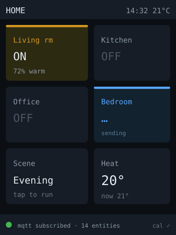

# touch-dashboard — idea

A wall- or desk-mounted control panel: a grid of tappable tiles for lights,
scenes, and switches, each showing current state, plus a couple of read-only
tiles for temperature and time.

**Why this board:** it's the cheapest board here with touch, and 240×320 fits a
comfortable 2×3 or 2×4 tile grid with targets big enough for resistive touch.
Dual-core means the network client runs off the UI core, so tiles stay
responsive while state syncs.

**Hard parts**

- **Resistive touch needs calibration.** XPT2046 raw values drift per unit and
  per temperature; ship a calibration routine (tap four corners, store to NVS)
  rather than hardcoding the map, or taps will land off-target.
- State must be *pushed*, not polled, or the panel shows stale state after
  someone uses a physical switch. Subscribe to the state topic; don't just fire
  commands.
- Optimistic UI: show the tap immediately, then reconcile with the reported
  state, and visibly revert if the command failed. A panel that lies is worse
  than one that's slow.
- Touch shares SPI with the display on this board — the community repo covers
  the sequencing.

**Pieces:** LVGL (or TFT_eSPI + `XPT2046_Touchscreen` for something lighter),
`PubSubClient` for MQTT, `Preferences` for calibration + config.

**Effort:** medium-large. Consider ESPHome instead if the goal is purely a Home
Assistant panel — it does this in YAML and you'd be reimplementing it.
