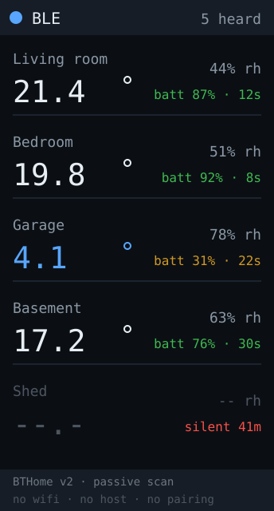

# ble-sensors — idea

A panel of cheap wireless thermometers. Listen passively to BLE
advertisements from battery sensors around the house and show a row per sensor:
temperature, humidity, battery, and how long since it last spoke.

**This is the one app here that needs no Wi-Fi, no computer and no cloud.** It
is a radio receiver with a screen. Plug it into any USB power source and it
works — which is the thing that kept coming up and that every other app on this
board fails at, because they all need either a network or an agent on a host.

**Why this board:** the tall panel is a list of rooms with a number each, which
is exactly what it's for — about 5 sensor rows at a readable size. No touch
needed because there is nothing to control. And the RGB LED can carry the one
thing worth knowing without reading: any sensor gone quiet, or any reading out
of range.

## Passive listening is the whole trick

The sensors **broadcast** their readings in the advertisement packet. Nothing
connects, nothing pairs, and the receiver has **no effect on sensor battery
life** — you can have as many panels listening as you like. That also means no
connection state to manage, no reconnect logic, and no pairing UX on a device
with one button.

That is a very different proposition from
[zigbee-hub](../zigbee-hub/), which needs the board to *be* a coordinator, hold
a network key in NVS, and probably drop Wi-Fi entirely to fit the stack in 4MB.
Here there is no stack to speak of: scan, parse, draw.

## The hardware

The **Xiaomi LYWSD03MMC** is the obvious sensor — roughly $5, coin cell, runs
for a year or more. Stock firmware encrypts its advertisements and expects Mi
Home to decrypt them, so the move is to reflash it with
[pvvx's ATC_MiThermometer](https://github.com/pvvx/ATC_MiThermometer) using the
web flasher, which broadcasts in an open format with no app or cloud in the path.

Three things about flashing that will waste your afternoon otherwise:

- **Battery must be above 40%** for a reliable reflash on the LYWSD03MMC.
- **You have to open the back cover** and press the pairing button to get it into
  advertising mode before the flasher can see it.
- **The device name must start with `ATC`** for BTHome v2 to be recognised by the
  flasher's format selection.

Other sensors broadcast compatibly — Qingping, some Inkbird, RuuviTag, SwitchBot
Meter — but each is a different parse, so start with one model.

## Parse BTHome v2, not the legacy formats

pvvx firmware **6.0 and later only supports BTHome v2**; the older Xiaomi, ATC
and "Custom" advert formats were dropped. So target BTHome v2 and nothing else —
supporting the legacy shapes is work that new sensors will never exercise.

BTHome is a small TLV structure inside the service data for UUID `0xFCD2`: an
object ID, then a little-endian value, repeated. Read the
[BTHome v2 spec](https://bthome.io/format/) for the object IDs and scaling
rather than inferring them from one sensor's output — getting a divisor wrong
produces a plausible number, which is the worst failure mode and one this repo
has already been bitten by.

**Leave encryption off** to start. BTHome supports encrypted adverts with a bind
key, and pvvx notes unencrypted is not recommended on general principle — but
these are room temperatures broadcast a few metres, and a bind key in flash on a
desk device is the same weak secret discussed in
[SECURITY.md](../../../SECURITY.md). Add it later if it matters; don't let it
block the first version.

## Hard parts

- **BLE 5 scanning may miss packets.** pvvx explicitly warns that ESPHome "does
  not work well with Bluetooth 5.0 and misses many advertising packets". The C6
  is a BLE 5 part, so expect to tune the scan: long window, high duty, and
  passive rather than active scanning. Verify you see *every* advert from one
  sensor over a few minutes before adding more.
- **Use NimBLE, not Bluedroid.** `NimBLE-Arduino` is dramatically lighter on
  heap, and this board has 512KB with no PSRAM. Measured free heap with the
  clock running is ~310KB, so there is room, but not for the full Bluedroid
  stack plus display buffers.
- **Stale is the important state.** A coin cell dies silently and the last
  reading just sits there looking authoritative. Track time since last advert
  per sensor, grey the row past a few minutes, and say so — the same rule every
  app here follows.
- **Identify sensors by MAC, label them by hand.** The adverts carry no room
  name. Keep a small MAC-to-label table in the source; auto-discovery on a
  screen with five rows and one button is not worth it.
- **No Bluetooth Classic on this chip.** The C6 is **BLE only** — no BR/EDR, so
  no A2DP, no classic serial port profile, no pairing with older peripherals.
  Anything requiring classic Bluetooth needs different hardware.

**Pieces:** `NimBLE-Arduino`, `<ui.h>` for schemes/rotation/gestures, a BTHome
v2 TLV parser (~50 lines), and a fixed MAC-to-label table. No Wi-Fi, so no
`secrets.h`, no TLS, and the default partition table would even be enough.

**Effort:** small-to-medium, and the smallest *dependency* surface of anything
in this directory — no network, no host, no API keys, nothing to break when a
vendor changes an endpoint. Get one sensor's advert parsing correct before
buying more.
