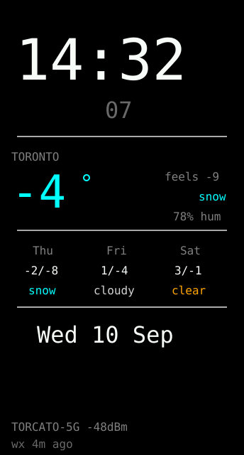
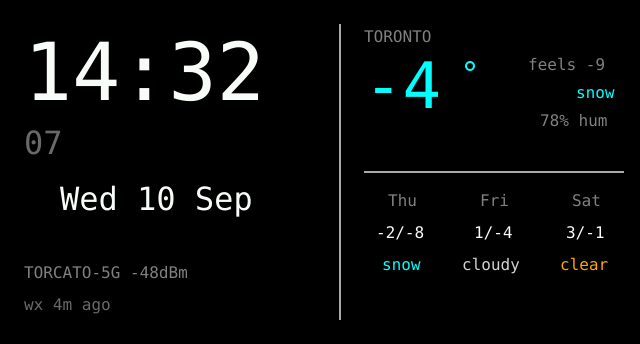
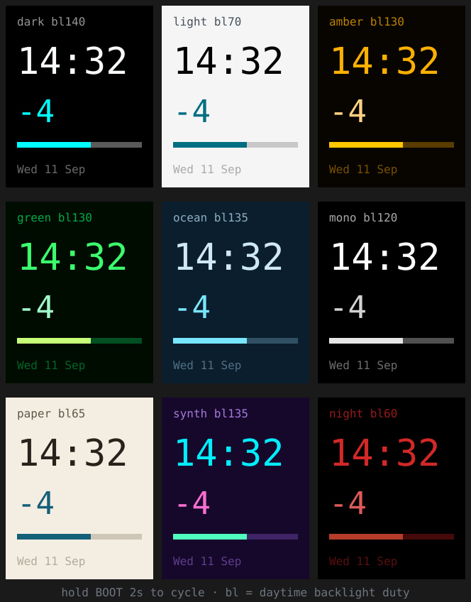

# desk-clock — **built**

NTP clock with current weather and a three-day forecast. Backlight dims
overnight, and the RGB LED tints by temperature.

Weather comes from [open-meteo](https://open-meteo.com) — **no API key needed**,
which is why it's the right source for this.

## The button does everything

| Gesture | Action |
|---|---|
| **Tap** (under 2s) | Next rotation: 0° → 90° → 180° → 270° |
| **Hold 2s** | Next colour scheme (nine of them) |
| **Hold 4.5s** | Blank the panel — any press brings it back |

The tap window is deliberately generous. It was 1.2s, and measured on this
board every ordinary press landed over that and cycled the *colour* instead of
rotating — which reads as "the button isn't responsive". Rotation is the
frequent action, so it gets the whole short range.

While you hold, a hint appears saying what releasing will do
(`release: COLOUR`, `release: SCREEN OFF`), so the gestures don't have to be
remembered. Both rotation and scheme persist in NVS.

The press is edge-captured in an interrupt rather than sampled in `loop()`.
That matters: `loop()` blocks for tens of milliseconds per pass, and a quick tap
that began *and ended* between two samples was previously never seen at all.

**Four rotations, not two**, because the USB-C socket is on a fixed edge — you
need the cable to exit left, right, top or bottom depending on how the board
sits. Rotations 0/2 are both 172×320 and 1/3 are both 320×172, so the two
layouts below cover all four; the 180° flips reuse the same coordinates and just
hand a different rotation to the driver.

| Portrait — 172×320 (rot 0, 180) | Landscape — 320×172 (rot 90, 270) |
|---|---|
|  |  |

### The nine colour schemes



Hold BOOT for 2s to cycle. `bl` is that scheme's daytime backlight duty, which
is also the board's main heat and power dial — `night` at 60 runs considerably
cooler than `dark` at 140.

Two are there for specific reasons rather than taste: **`paper`** is a warm
off-white that is much easier than `light`'s pure white in a lit room, and
**`night`** is dim red on black, which preserves dark adaptation and is the one
to pick for a bedside table.

Nine schemes on one button means reaching the last is nine holds. They live in
an array in [`lib/board/ui.h`](../../lib/board/ui.h) and `UI_SCHEME_COUNT` is
derived from it, so deleting the ones you never pick needs no other change.

All coordinates live in a `Layout` struct picked at runtime, so the dirty rects
stay exact and `selfCheck()` asserts **both** layouts at boot — stronger
coverage than when only the compiled one existed.

**The offsets already worked.** `(34, 0, 34, 0)` in `board.h` is correct in all
four rotations, because the driver selects a different offset pair per rotation
and 240 − 172 − 34 = 34 makes the panel symmetric. Worth checking rather than
assuming — it's what makes runtime rotation safe.

## Brightness (and heat)

A white background emits far more light than a black one at the same backlight
duty, so **brightness belongs to the theme**, not to one global pair. Both
values live in [`lib/board/ui.h`](../../lib/board/ui.h) — a setting to edit, not
a button gesture:

Each of the nine schemes carries its own pair — see the table in the preview
above. They range from `night` at 60/12 to `dark` at 140/40, and the light
schemes sit lowest of all because a near-white panel at 140 is genuinely
unpleasant. Night levels apply between `uiNightFrom`/`uiNightTo` (23:00–07:00)
and switch on the minute tick.

These defaults are lower than they were because I measured the heat. **The
backlight is the dominant heat source** — dropping 200 → 140 cut the die
temperature by 6 °C, while halving the CPU clock and parking the radio bought
only 2 °C. Full numbers in the [device README](../../README.md#heat--its-the-backlight-measured).

`POWER_SAVE` at the top of [`src/main.cpp`](src/main.cpp) sets the CPU to 80MHz;
set it to `0` to compare against 160MHz. Radio settings live in
[`netTune()`](../../lib/board/netjoin.h), which uses `WIFI_PS_MIN_MODEM` —
`MAX_MODEM` saved 2 °C but dropped ACKs on a marginal link, and disabling sleep
entirely cost 12 °C. The die temperature, Wi-Fi state and button counters are
logged every 10s.

### Why long press doesn't really power off

It blanks the display (backlight to 0 plus ST7789 `SLPIN`) and leaves the app
running. True deep sleep is possible, but **the button could not wake it**: BOOT
is GPIO9, and the C6's RTC-capable pins are GPIO0–7 (`SOC_RTCIO_PIN_COUNT == 8`),
so only RESET or a timer could bring it back. On a permanently USB-powered clock
that's a worse interface for no meaningful power saving.

Keeping the app alive also means time and weather are already current when the
screen returns, instead of showing a stale clock while it re-syncs.

## Run it

Two things to set first.

**1. Wi-Fi credentials.** Paths below are relative to the **device** directory
(`esp32-c6-lcd-1.47/`), which is also where `pio` has to run from:

```sh
cd esp32-c6-lcd-1.47
cp lib/board/secrets.h.example lib/board/secrets.h   # skip if it already exists
$EDITOR lib/board/secrets.h
```

The template is
[`lib/board/secrets.h.example`](../../lib/board/secrets.h.example) — tracked in
git. Your filled-in `secrets.h` sits beside it and is gitignored, so it never
gets committed. It's shared by every app on this board, not just this one.

**2. Your location and timezone.** The defaults at the top of
[`src/main.cpp`](src/main.cpp) are **Toronto** — change them if that's wrong:

```cpp
static const char *TZ_STRING = "EST5EDT,M3.2.0/2,M11.1.0/2";
static const float LAT = 43.6532f, LON = -79.3832f;
static const char *PLACE = "TORONTO";
```

Use a real POSIX TZ string, not a fixed UTC offset — that's what makes DST
automatic instead of a twice-yearly reflash.

```sh
~/.platformio-venv/bin/pio run -e desk-clock -t upload
```

On boot the serial log tells you where you stand:

```
wifi ok TORCATO-5G -48dBm ip 192.168.1.42
ntp ok
selfcheck ok
wx ok -4.0C snow
```

## Don't use a guest network

This app needs **NTP (UDP 123)** and **HTTPS out**. A UniFi *Guest* network
intercepts everything until portal auth, so the board associates, gets a DHCP
lease, and then nothing works — which looks like a broken app and isn't.

The failure is confusing on purpose: a captive portal accepts TCP to *any*
destination so it can serve a redirect, so a plain TCP test to port 443
**succeeds**, and only the TLS handshake fails with `SSL - The connection
indicated an EOF`. On plain HTTP it shows itself:

```
tcp  188.40.99.226:443 -> ok
http status: HTTP/1.1 302 Moved Temporarily
redirected to: http://10.0.10.1:8880/guest/s/default/?ap=...   <-- captive portal
```

Use a **dedicated IoT WLAN** instead — no portal, WPA2, on its own VLAN. That's
also what [SECURITY.md](../../../SECURITY.md) recommends for a device that could
be stolen, so the two concerns point the same way.

`diagnoseNet()` runs automatically when NTP fails and prints the DNS result,
gateway reachability, a TCP probe, the portal check and free heap. It exists
because "ntp FAILED" on its own can't tell a portal from a firewall from a
fragmented heap.

## Tunables

| Constant | Default | Why you'd change it |
|---|---|---|
| `Theme.blDay` / `blNight` | see above | Per-theme backlight. Tune in the dark |
| `uiNightFrom` / `uiNightTo` | 23 / 7 | When to dim (in `ui.h`) |
| `WX_PERIOD_MS` | 15 min | Weather poll. open-meteo is free; don't hammer it |

## How it stays flicker-free

Every draw goes through `field()`, which erases an **exact box** then draws into
it. Boxes are fixed at compile time, so a shorter string can never leave stale
pixels from a longer one. `loop()` never calls `fillScreen()` — the minute block
repaints once a minute and the seconds once a second, nothing else.

This is easier than it sounds here because Arduino_GFX has **no bundled
proportional fonts** — only the built-in 6×8, which scales by integer factor. A
glyph is exactly `6*size × 8*size`, so the dirty rectangles are exact rather than
measured. `setTextSize(5)` gives 30×40px digits, and `"14:32"` is exactly 150px
wide on a 172px panel.

## What building it actually taught me

Four things that weren't obvious from the plan:

- **The default partition table is too small.** WiFi + TLS + ArduinoJson +
  Arduino_GFX reached **93.2%** of the default 1.31MB app partition, because a
  4MB flash gets split into two OTA slots. `board_build.partitions =
  huge_app.csv` gives a single ~3MB partition and drops it to **38.8%**. Any app
  on this board that does TLS will hit this.
- **Never call `WiFi.reconnect()` from a fast loop.** My first version called it
  every 250ms while disconnected and the log filled with
  `E wifi:sta is connecting, return error`. `WiFi.setAutoReconnect(true)` in
  `setup()` already handles retries — the fix was deleting code.
- **USB CDC eats your boot logs.** The port takes ~2s to enumerate, so anything
  printed at the top of `setup()` is simply never seen. The self-check runs early
  (where its asserts can abort before anything draws) but logs at the *end* of
  `setup()`.
- **The JSON filter is mandatory, not an optimization.** open-meteo's full
  response will not fit in this heap alongside the display buffers.
- **A 14-char box at size 2 is 168px and overruns the 172px panel.** The date
  footer did exactly that — the text still centred fine so it looked correct,
  but the erase rect was clipping. The layout bounds assert in `selfCheck()`
  caught it. This is the failure mode that looks fine until a longer string
  shows up.

## Self-check

`selfCheck()` asserts two things: the WMO weather-code → label map, and that
every layout box fits **the orientation that was compiled** — time, date, status
strip, three forecast columns, and the footer. Those bounds asserts are what make
a second orientation safe to add; a bad constant panics the chip at boot rather
than quietly drawing off the edge. It prints `selfcheck ok` when it passes.

Both orientations are verified on hardware: `selfcheck ok` from a
`desk-clock-h` flash.

## Not done

- **Weather icons.** Text labels only. Icons mean either a font with glyphs or
  bitmaps in flash; the labels read fine at this size.
- **Runtime config.** Location and TZ are compile-time constants. A captive
  portal to set them would be more code than reflashing when you move.
- **Sunrise/sunset, wind, UV.** open-meteo returns them, and the panel has room
  in the footer if you want them.
