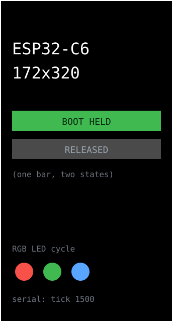

# hello — **built**




Smoke test for the board. Not an app, a check: it exists so that when a real app
draws wrong, you can tell whether the board setup or your code is at fault.

Verifies four things at once:

- **Display + offset** — a 1px white border. If it hugs all four edges the 34px
  column offset is correct; if the right edge is missing or there's a junk
  stripe, it isn't.
- **Backlight PWM** — screen lit at duty 200/255.
- **RGB LED** — cycles red → green → blue, so a dead channel is visible.
- **BOOT button** — the bar under the text turns green while GPIO9 is held.

Serial prints a tick every 500ms, which also confirms USB CDC is routed to the
native USB port rather than the UART pins.

```sh
pio run -e hello -t upload -t monitor
```

## Settings

Tunables live in [`data/config.json`](data/config.json) on the device, read via
[`lib/board/appcfg.h`](../../lib/board/appcfg.h). Push a change without a
rebuild:

```sh
./push-config hello
```

Every key is optional and the app runs on its compiled defaults with the file
absent. Out-of-range values are rejected and named on the serial log rather than
silently clamped. **Credentials are not in here** and must not be — they live in
`secrets.h`, which is gitignored and compiled in, because this file sits on a
filesystem anyone holding the board can dump. See
[SECURITY.md](../../../SECURITY.md) and
[APP-CHECKLIST.md](../../APP-CHECKLIST.md#configuration).

The smallest config in the repo, and the reference for the convention:
backlight duty and the tick interval. Deliberately bright -- this screen exists
to check pixels, not to be looked at.
