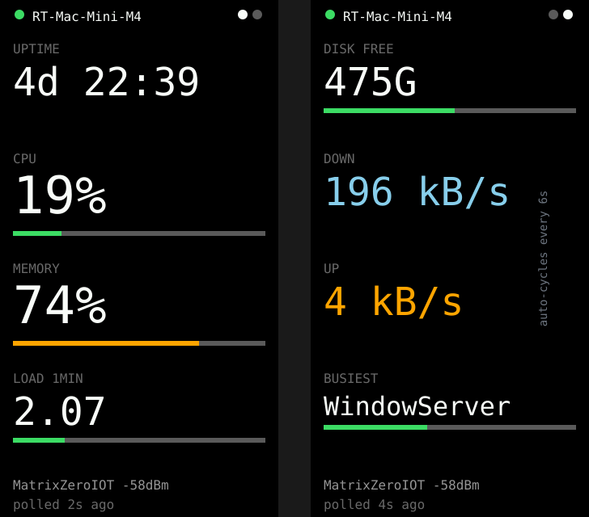

# host-monitor — **built** (read-only)




An always-on status panel for **any machine** that runs one of the agents:
uptime, load, memory, disk, CPU, network throughput and the busiest process.

**The firmware is not OS-specific.** It parses a fixed set of JSON keys and has
no idea what produced them — the agent is the only platform-aware piece, and the
JSON contract is the boundary. Agents ship for macOS and Linux; anything that
can serve those keys works with the firmware unchanged.

It is also **not a USB display**: plugging it into a computer only powers it, and
the data arrives over Wi-Fi. So it can watch a machine other than the one it is
plugged into — a server across the house, powered from a phone charger.

**Why this board:** it's the ideal shape for a stat stack. Roughly 10 label/value
rows fit on 172×320 with no scrolling, so the whole machine's state is one
glance with nothing hidden. Always USB-powered, so it can sit next to the mini
permanently. And the RGB LED carries reachability without needing to read
anything: green = up, amber = asleep, red = unreachable.

## Status: the stats panel works, sleep/wake is not built

Built and running on hardware: a **read-only** two-page stats panel. The
sleep/wake button below is phase two and deliberately not done yet — see
[Why not the button yet](#why-not-the-button-yet).

### Two auto-cycling pages

Two pages exist so the numbers can be **big**: less per screen buys size 3 and 4
glyphs instead of rows of size 1 text. They alternate every 6 seconds
(`PAGE_MS`), with dots at the top right showing which page is up.

| Page 1 | Page 2 |
|---|---|
| uptime, CPU %, memory %, 1-min load | disk free, download, upload, busiest process |

Pages **auto-cycle rather than being button-driven** because this board has one
readable button and its three gestures are already spent on rotation, colour
scheme and blanking. A glanceable panel shouldn't need touching anyway.

Bars are colour-thresholded — green under 60%, amber to 85, red above — which
does more for readability at a glance than any amount of styling.

### Setup — USB, no network

Default is `HOST_SOURCE_SERIAL 1`: the board reads stats over the **USB cable it
is already plugged into**. Two commands, no configuration at all — no Wi-Fi, no
IP address, no URL, no firewall rule, no credentials:

```sh
cd esp32-c6-lcd-1.47/apps/host-monitor/agent
python3 macos.py --serial          # or: python3 linux.py --serial
```

It finds the board's port itself, and reopens it if the board is replugged or
reflashed. Standard library only — writing to a serial device is plain file I/O,
so pyserial is not needed either.

**The port is the identity**, which is the nice part: the panel shows whatever
machine it is plugged into. Move the cable to another computer, run the script
there, and it follows. Nothing to reconfigure.

If the feed stops — script killed, laptop asleep, cable pulled — the panel goes
to `NO HOST` after 15s rather than leaving a frozen number looking current.

### Why a script is unavoidable

This is a hardware limit, not a design choice. **No operating system volunteers
its stats over USB**; a host treats a USB device as a peripheral and tells it
essentially nothing about itself. The usual workarounds need the board to
pretend to be something else, and on this chip it cannot:

```
ESP32-C6:  SOC_USB_SERIAL_JTAG_SUPPORTED 1     (no OTG)
ESP32-S3:  SOC_USB_OTG_SUPPORTED 1
```

The C6 has a **USB Serial/JTAG controller only** — not the USB-OTG peripheral
the S2/S3 have. So it can only ever be a CDC serial device: no HID keyboard, no
mass-storage volume, no network gadget. There is no trick to extract data from a
host running nothing.

What the board *could* know with genuinely zero host software is only whether a
host is enumerated and awake, plus its own die temperature and uptime. That is
not a monitor.

So the achievable goal is **no settings**, not **no software** — and that is what
serial mode delivers: one command, nothing to configure.

### Watching a different machine (optional)

Set `HOST_SOURCE_SERIAL 0` to use the HTTP path instead, for a host that is not
the one it is plugged into — a NAS, or a server across the house. That brings
back Wi-Fi, `HOST_AGENT_URL`, mDNS and the setup portal, and on a segmented
network it needs a firewall rule. Serial mode uses about **53KB less heap**
(362KB free versus 309KB) because no Wi-Fi stack is initialised.

### Setup — HTTP over Wi-Fi

**1. Run an agent on the host you want to watch.** Standard library only on
both platforms, so there is nothing to install.

**macOS:**

```sh
cd esp32-c6-lcd-1.47/apps/host-monitor/agent
python3 macos.py                                      # foreground, port 8787
curl -s localhost:8787/stats | python3 -m json.tool   # sanity check
```

Keep it running across reboots with the LaunchAgent (runs as you, not root —
read-only stats need no privileges):

```sh
mkdir -p ~/Library/LaunchAgents
sed "s|__PATH__|$PWD/macos.py|" com.rtorcato.host-monitor.plist \
  > ~/Library/LaunchAgents/com.rtorcato.host-monitor.plist
launchctl load ~/Library/LaunchAgents/com.rtorcato.host-monitor.plist
```

**Linux:**

```sh
cd esp32-c6-lcd-1.47/apps/host-monitor/agent
python3 linux.py --selftest     # checks the parsers; runs on any OS
python3 linux.py                # foreground, port 8787
python3 linux.py --disk /volume1   # Synology: report the data volume, not root
```

Keep it running with systemd (runs as `nobody`, `ProtectSystem=strict`):

```sh
sudo cp host-monitor.service /etc/systemd/system/
sudo sed -i "s|__PATH__|$PWD/linux.py|" /etc/systemd/system/host-monitor.service
sudo systemctl enable --now host-monitor
```

**2. Allow the board to reach it.** This is the step that will bite you: the
board is on the **IoT VLAN** and the Mac is not, and UniFi blocks IoT → LAN by
default. Measured on this setup: board `10.0.40.67` (VLAN 40), Mac `10.0.10.92`
(VLAN 10), and every poll failed until a rule existed.

Add a UniFi firewall rule, **above** the rule that isolates IoT:

| Field | Value |
|---|---|
| Action | Allow |
| Source | `10.0.40.67` (the board, not the whole VLAN) |
| Destination | `10.0.10.92` port `8787`, TCP |

One host, one port — least privilege, same reasoning as
[SECURITY.md](../../../SECURITY.md). The panel's `NO AGENT` screen names this
explicitly, so a fresh install tells you what to do instead of just failing.

**3. Point the firmware at the host.** Override in `lib/board/secrets.h` rather
than editing the source:

```c
#define HOST_AGENT_URL "http://10.0.10.92:8787/stats"
```

```sh
~/.platformio-venv/bin/pio run -e host-monitor -t upload
```

**One URL is compiled in**, so switching which machine it watches means a
reflash today. Runtime switching would need the URL in NVS plus a way to set it
— a config portal, which is real work and not done.

### Seeing the layout without a working agent

`DEMO_STATS 1` at the top of `src/main.cpp` renders a fixed capture from a real
M4 mini and skips polling entirely. Useful for checking both orientations before
the network path works.

### Changing which host it watches

Three ways, cheapest first:

**Hold BOOT for 6 seconds** — a hint appears saying `release: SETUP`. The board
raises a brief WPA2 access point and shows the details on screen:

```
wifi: host-monitor-setup
pass: setup-panel
open: http://192.168.4.1
```

Join it, set the agent URL, save, and it reboots into normal operation. The URL
persists in NVS and overrides the compiled-in default. The portal closes itself
after 3 minutes, and any button press cancels it, so you can't get stuck there.

**Use a `.local` name** instead of an IP and DHCP stops mattering:

```
http://rt-mac-mini.local:8787/stats
```

`HTTPClient` alone can't do this — it hands the name to normal DNS, which does
not answer for `.local`, so the connect just fails. The firmware resolves it
over mDNS and substitutes the address, re-resolving whenever polls are failing,
so a host that moves recovers on its own. The board also advertises itself as
`host-monitor.local`.

**Edit `HOST_AGENT_URL`** in `secrets.h` and reflash. Still the right choice for
a permanent install.

### Which machines make sense

| Host | Works? | Notes |
|---|---|---|
| **Mac mini / always-on Mac** | Yes | `macos.py`. The intended target: always on, fixed address. |
| **Linux server, Pi** | Yes | `linux.py` + the systemd unit. |
| **Synology NAS** | With work | `/proc` is there, but **install Python 3 from Package Center or run it in Container Manager**, DSM's init is not stock systemd (use Task Scheduler or a container restart policy), and pass **`--disk /volume1`** or it reports the ~2GB system partition instead of your array. |
| **MacBook** | Poorly | The agent runs fine; the laptop is the problem. It sleeps, and DHCP moves its address. A `.local` name fixes the address half; nothing fixes the sleeping half. |
| **iPad / iPhone** | **No** | iPadOS cannot run a background HTTP server or read system-wide stats. Sandboxed Python apps can't help. |

Worth repeating because it's the most common misunderstanding: **plugging the
board into a computer only powers it.** An iPad USB-C port is a perfectly good
power supply, and the panel will keep showing whatever host its URL points at —
which has nothing to do with the device supplying the power.

### The JSON contract

This is the portable boundary. Any agent serving these keys works with the
existing firmware:

```json
{
  "host": "RT-Mac-Mini-M4", "uptime_s": 427174,
  "load": [2.07, 2.10, 2.06], "cpu_pct": 19, "mem_pct": 74,
  "disk_free_gb": 475.1, "disk_total_gb": 994.7,
  "net_down_bps": 196413.3, "net_up_bps": 4499.1,
  "top_name": "WindowServer", "top_pct": 41.0, "cpu_temp_c": null
}
```

The firmware validates `uptime_s` before trusting any of it, so a 200 from
something that is not an agent renders as `NO AGENT` rather than as plausible
zeroes.

`mem_pct` is **used** percent, not free, on both platforms. macOS uses all spare
RAM for cache and Linux reports the same way, so "free" is always low and means
nothing; macOS derives it from `vm_stat` and Linux from `MemAvailable`.

`cpu_temp_c` is `null` on both: macOS needs root for `powermetrics`, and Linux
thermal-zone naming varies too much per board to guess. The panel shows `--`
rather than reporting a number that might be the wrong sensor.

### What each agent uses

| Stat | macOS | Linux |
|---|---|---|
| uptime | `sysctl kern.boottime` | `/proc/uptime` |
| load | `os.getloadavg()` | `/proc/loadavg` |
| memory | `vm_stat` | `/proc/meminfo` (`MemAvailable`) |
| cpu | `ps` aggregate ÷ cores | `/proc/stat` jiffy deltas |
| disk | `os.statvfs("/")` | `os.statvfs("/")` |
| net | `netstat -ibn` deltas | `/proc/net/dev` deltas |
| busiest | `ps -Aro pcpu,comm` | `/proc/<pid>/stat` sampled twice |

The Linux agent reads `/proc` rather than shelling out, so there are no
per-distribution output-format differences and the parsers stay pure — which is
why `--selftest` can verify them from a Mac.

**Windows would need a third agent.** `os.getloadavg()` and `os.statvfs()` are
Unix-only, so it would need WMI or `psutil` rather than a port of either file.

### Why not the button yet

Two reasons, both worth knowing before adding it:

- **All three BOOT gestures are taken** (rotation, colour scheme, blanking), so
  a sleep action needs a fourth gesture or a different input.
- **Sleep is one-way from a panel's point of view.** Wake-on-LAN cannot cold-boot
  a Mac, so `shutdown` would strand you; only sleep/wake is recoverable. That
  plus the token, bound interface and least-privilege work is why the read-only
  panel came first — it is useful on its own and has no security surface.

## The part to get straight first

**You cannot power the mini *on* from off.** Wake-on-LAN on macOS wakes from
*sleep* only — cold boot over the network is unsupported on all Macs, and
Apple Silicon especially, for firmware reasons. So the honest feature is
**sleep / wake**, not power on/off:

| Action | How | Works when |
|---|---|---|
| Sleep | agent on the Mac runs `pmset sleepnow` | Mac is awake and the agent is running |
| Wake | C6 sends a WoL magic packet | Mac is **asleep**, not shut down |
| Shut down | agent runs `shutdown -h now` | Mac is awake — **and then only a physical press brings it back** |

Two consequences worth designing around:

- **Offer sleep, not shutdown.** Once it's shut down the panel can't recover it,
  which turns a button press into a trip to the desk. If you do include
  shutdown, put it behind a separate, harder confirmation than sleep.
- **WoL needs wired Ethernet** with `sudo pmset -a womp 1`. Wake-on-Wireless is
  unreliable on consumer hardware — use the mini's Ethernet MAC, not its Wi-Fi
  MAC, in the magic packet.
- **Darkwake:** a magic packet often wakes the Mac for only ~30–60s before it
  sleeps again, because network wakes enter a partial "darkwake" state and
  repeated packets don't extend it. If you want it to *stay* up, have the agent
  run `caffeinate` for a window after waking, or open a real session (SSH) right
  after the packet.

## Getting the stats

The C6 can't read macOS state on its own — something has to run on the mini. A
small LaunchAgent that serves one JSON blob is the whole backend:

```
uptime          sysctl kern.boottime      → seconds, format on the C6
load            sysctl vm.loadavg         → 1/5/15 min
memory pressure memory_pressure           → % free is misleading on macOS;
                                            pressure is the number that matters
disk free       statfs / df               → per-volume
cpu temp        powermetrics (needs root) → or skip; it's the fiddliest one
network         netstat -ib deltas        → bytes/s up and down
top process     ps -Aro pcpu,comm         → one line, name + %
```

Poll it from the C6 every 2–5s with `HTTPClient`. Don't push from the Mac —
polling means the C6 recovers on its own after either side restarts, with no
retry logic on the Mac.

## Security — do not skip this

**The agent exposes an endpoint that can sleep or shut down your Mac.** On any
shared or untrusted network that is a real handoff of control, so:

- Require a **shared secret** on every state-changing request (bearer token in a
  header, compared with a constant-time compare). Read-only `/stats` can be open
  if you like; `/sleep` must not be.
- **Bind the listener to the LAN interface**, never `0.0.0.0` with a router port
  forward. This should be unreachable from the internet.
- Keep the token in `secrets.h` (already gitignored) on the C6 side and in a
  file with `600` perms on the Mac side — not in the LaunchAgent plist, which is
  world-readable.
- Give the agent the **least privilege that works**. `pmset sleepnow` needs no
  root. `shutdown -h now` does — which is another reason to prefer sleep.
- Log every action request on the Mac side. If the panel ever sleeps the machine
  unexpectedly you want to know whether the request came from the C6.

## Input with one button

There is no touchscreen — GPIO9 is the only input, so the interaction has to be
a small state machine:

- **Short press** — cycle stat pages (overview / disks / network / processes).
- **Long press (2s)** — arm the sleep action; show a countdown and require a
  second press to confirm. A single long press must never sleep the machine, or
  you'll do it by accident while paging.
- **If unreachable** — long press sends the WoL packet instead, since sleeping an
  already-asleep Mac is meaningless. Same button, state-dependent meaning, shown
  on screen.

**Pieces:** `HTTPClient` + `ArduinoJson` (with a filter) on the C6, `WiFiUdp` for
the magic packet, `Preferences` for host/MAC/token, Arduino_GFX. On the Mac: a
LaunchAgent running a Python or shell HTTP server — ~60 lines.

**Effort:** medium, and it splits cleanly. **Build the read-only stats panel
first** — it's genuinely useful on its own, has no security surface, and gets
the layout right. Add the sleep/wake button only once that's solid.

## Settings

Tunables live in [`data/config.json`](data/config.json) on the device, read via
[`lib/board/appcfg.h`](../../lib/board/appcfg.h). Push a change without a
rebuild:

```sh
./push-config host-monitor
```

Every key is optional and the app runs on its compiled defaults with the file
absent. Out-of-range values are rejected and named on the serial log rather than
silently clamped. **Credentials are not in here** and must not be — they live in
`secrets.h`, which is gitignored and compiled in, because this file sits on a
filesystem anyone holding the board can dump. See
[SECURITY.md](../../../SECURITY.md) and
[APP-CHECKLIST.md](../../APP-CHECKLIST.md#configuration).

Poll, retry and stale intervals, page dwell, and optional backlight/night
overrides. Two things deliberately absent: the setup-portal password (a WPA2
credential, so it belongs in `secrets.h`) and the transport choice, which stays
compile-time because the serial and HTTP paths pull in different libraries.
