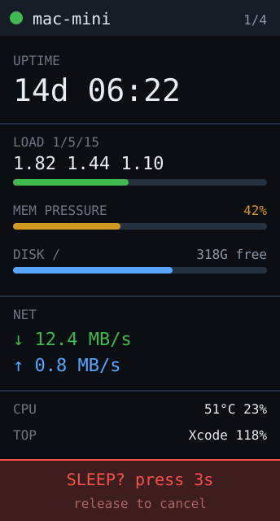

# mac-mini — **built** (read-only)




A always-on status panel for the Mac mini: uptime, load, memory pressure, disk
free, CPU temp, network throughput — plus a button to sleep it and wake it back
up.

**Why this board:** it's the ideal shape for a stat stack. Roughly 10 label/value
rows fit on 172×320 with no scrolling, so the whole machine's state is one
glance with nothing hidden. Always USB-powered, so it can sit next to the mini
permanently. And the RGB LED carries reachability without needing to read
anything: green = up, amber = asleep, red = unreachable.

## Status: the stats panel works, sleep/wake is not built

Built and running on hardware: a **read-only** two-page stats panel. The
sleep/wake button below is phase two and deliberately not done yet — see
[Why not the button yet](#why-not-the-button-yet).

### Two auto-cycling pages

Two pages exist so the numbers can be **big**: less per screen buys size 3 and 4
glyphs instead of rows of size 1 text. They alternate every 6 seconds
(`PAGE_MS`), with dots at the top right showing which page is up.

| Page 1 | Page 2 |
|---|---|
| uptime, CPU %, memory %, 1-min load | disk free, download, upload, busiest process |

Pages **auto-cycle rather than being button-driven** because this board has one
readable button and its three gestures are already spent on rotation, colour
scheme and blanking. A glanceable panel shouldn't need touching anyway.

Bars are colour-thresholded — green under 60%, amber to 85, red above — which
does more for readability at a glance than any amount of styling.

### Setup

**1. Run the agent on the Mac.** Standard library only, nothing to install:

```sh
cd esp32-c6-lcd-1.47/apps/mac-mini/agent
python3 mac-stats-agent.py            # foreground, port 8787
curl -s localhost:8787/stats | python3 -m json.tool   # sanity check
```

To keep it running across reboots, install the LaunchAgent:

```sh
mkdir -p ~/Library/LaunchAgents
sed "s|__PATH__|$PWD/mac-stats-agent.py|" com.rtorcato.mac-stats-agent.plist \
  > ~/Library/LaunchAgents/com.rtorcato.mac-stats-agent.plist
launchctl load ~/Library/LaunchAgents/com.rtorcato.mac-stats-agent.plist
```

**2. Allow the board to reach it.** This is the step that will bite you: the
board is on the **IoT VLAN** and the Mac is not, and UniFi blocks IoT → LAN by
default. Measured on this setup: board `10.0.40.67` (VLAN 40), Mac `10.0.10.92`
(VLAN 10), and every poll failed until a rule existed.

Add a UniFi firewall rule, **above** the rule that isolates IoT:

| Field | Value |
|---|---|
| Action | Allow |
| Source | `10.0.40.67` (the board, not the whole VLAN) |
| Destination | `10.0.10.92` port `8787`, TCP |

One host, one port — least privilege, same reasoning as
[SECURITY.md](../../../SECURITY.md). The panel's `NO AGENT` screen names this
explicitly, so a fresh install tells you what to do instead of just failing.

**3. Point the firmware at it** if your Mac isn't at the default. Either edit
`MAC_AGENT_URL` at the top of [`src/main.cpp`](src/main.cpp) or override it in
`lib/board/secrets.h`:

```c
#define MAC_AGENT_URL "http://10.0.10.92:8787/stats"
```

```sh
~/.platformio-venv/bin/pio run -e mac-mini -t upload
```

### Seeing the layout without a working agent

`DEMO_STATS 1` at the top of `src/main.cpp` renders a fixed capture from a real
M4 mini and skips polling entirely. Useful for checking both orientations before
the network path works.

### Why not the button yet

Two reasons, both worth knowing before adding it:

- **All three BOOT gestures are taken** (rotation, colour scheme, blanking), so
  a sleep action needs a fourth gesture or a different input.
- **Sleep is one-way from a panel's point of view.** Wake-on-LAN cannot cold-boot
  a Mac, so `shutdown` would strand you; only sleep/wake is recoverable. That
  plus the token, bound interface and least-privilege work is why the read-only
  panel came first — it is useful on its own and has no security surface.

## The part to get straight first

**You cannot power the mini *on* from off.** Wake-on-LAN on macOS wakes from
*sleep* only — cold boot over the network is unsupported on all Macs, and
Apple Silicon especially, for firmware reasons. So the honest feature is
**sleep / wake**, not power on/off:

| Action | How | Works when |
|---|---|---|
| Sleep | agent on the Mac runs `pmset sleepnow` | Mac is awake and the agent is running |
| Wake | C6 sends a WoL magic packet | Mac is **asleep**, not shut down |
| Shut down | agent runs `shutdown -h now` | Mac is awake — **and then only a physical press brings it back** |

Two consequences worth designing around:

- **Offer sleep, not shutdown.** Once it's shut down the panel can't recover it,
  which turns a button press into a trip to the desk. If you do include
  shutdown, put it behind a separate, harder confirmation than sleep.
- **WoL needs wired Ethernet** with `sudo pmset -a womp 1`. Wake-on-Wireless is
  unreliable on consumer hardware — use the mini's Ethernet MAC, not its Wi-Fi
  MAC, in the magic packet.
- **Darkwake:** a magic packet often wakes the Mac for only ~30–60s before it
  sleeps again, because network wakes enter a partial "darkwake" state and
  repeated packets don't extend it. If you want it to *stay* up, have the agent
  run `caffeinate` for a window after waking, or open a real session (SSH) right
  after the packet.

## Getting the stats

The C6 can't read macOS state on its own — something has to run on the mini. A
small LaunchAgent that serves one JSON blob is the whole backend:

```
uptime          sysctl kern.boottime      → seconds, format on the C6
load            sysctl vm.loadavg         → 1/5/15 min
memory pressure memory_pressure           → % free is misleading on macOS;
                                            pressure is the number that matters
disk free       statfs / df               → per-volume
cpu temp        powermetrics (needs root) → or skip; it's the fiddliest one
network         netstat -ib deltas        → bytes/s up and down
top process     ps -Aro pcpu,comm         → one line, name + %
```

Poll it from the C6 every 2–5s with `HTTPClient`. Don't push from the Mac —
polling means the C6 recovers on its own after either side restarts, with no
retry logic on the Mac.

## Security — do not skip this

**The agent exposes an endpoint that can sleep or shut down your Mac.** On any
shared or untrusted network that is a real handoff of control, so:

- Require a **shared secret** on every state-changing request (bearer token in a
  header, compared with a constant-time compare). Read-only `/stats` can be open
  if you like; `/sleep` must not be.
- **Bind the listener to the LAN interface**, never `0.0.0.0` with a router port
  forward. This should be unreachable from the internet.
- Keep the token in `secrets.h` (already gitignored) on the C6 side and in a
  file with `600` perms on the Mac side — not in the LaunchAgent plist, which is
  world-readable.
- Give the agent the **least privilege that works**. `pmset sleepnow` needs no
  root. `shutdown -h now` does — which is another reason to prefer sleep.
- Log every action request on the Mac side. If the panel ever sleeps the machine
  unexpectedly you want to know whether the request came from the C6.

## Input with one button

There is no touchscreen — GPIO9 is the only input, so the interaction has to be
a small state machine:

- **Short press** — cycle stat pages (overview / disks / network / processes).
- **Long press (2s)** — arm the sleep action; show a countdown and require a
  second press to confirm. A single long press must never sleep the machine, or
  you'll do it by accident while paging.
- **If unreachable** — long press sends the WoL packet instead, since sleeping an
  already-asleep Mac is meaningless. Same button, state-dependent meaning, shown
  on screen.

**Pieces:** `HTTPClient` + `ArduinoJson` (with a filter) on the C6, `WiFiUdp` for
the magic packet, `Preferences` for host/MAC/token, Arduino_GFX. On the Mac: a
LaunchAgent running a Python or shell HTTP server — ~60 lines.

**Effort:** medium, and it splits cleanly. **Build the read-only stats panel
first** — it's genuinely useful on its own, has no security surface, and gets
the layout right. Add the sleep/wake button only once that's solid.
