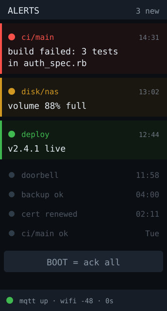

# notifier — idea

An ambient alert screen. Subscribe to MQTT topics (or expose an HTTP endpoint),
show incoming messages as a stacked feed, and flash the RGB LED in a colour
keyed to severity. CI failed → red. Deploy finished → green. Doorbell → blue.

**Why this board:** a glanceable second screen that isn't a phone. The tall
panel holds a handful of recent messages, the LED carries urgency without being
read, and there is no touchscreen to miss because notifications need no input —
one BOOT press to acknowledge and clear is enough.

**Hard parts**

- Decide push vs. pull early. MQTT means running a broker; an HTTP endpoint means
  the board needs a stable LAN address and something willing to POST to it.
  MQTT is less work if a broker already exists, more if it doesn't.
- Reconnection is the whole reliability story. Wi-Fi and the broker will both
  drop; without backoff-and-retry the display silently goes stale, which is
  worse than blank. Show connection state on screen somewhere small.
- Long messages need wrapping and a scroll/eviction policy on 172px width.
- The LED at full brightness in a dark room is genuinely unpleasant. Keep a
  brightness constant and treat it as a knob to tune, not a fixed value.

**Pieces:** `PubSubClient` or `espMQTTClient` (or `WebServer` for the HTTP
route), Arduino_GFX, `Preferences` for Wi-Fi/broker config.

**Effort:** medium — small happy path, and the reconnect handling is most of it.
