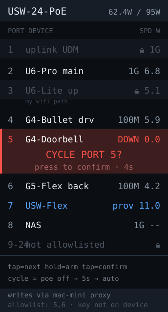

# poe-cycle — idea



Per-port view of a UniFi switch: link state, negotiated speed, PoE mode and
watts drawn per port — plus the ability to power-cycle a port to reboot a wedged
AP or camera without opening a laptop.

**Why this board:** a switch is a list of ports, and a tall panel shows 8–10 of
them with a number each. The desk-side "reboot the stuck AP" button is a genuine
admin convenience: the thing you want is always three taps deep in an app, and
here it's one device you glance at and press.

## This one writes, so treat it differently

Every other app in this directory is read-only. This one changes device state,
which makes it the only one with a real blast radius: **power-cycling the wrong
port can drop the AP you're connected over, or the camera covering your door.**
That shapes the design more than the UI does.

- **Confirm explicitly, and name the target.** One button (GPIO9) means: short
  press to move the selection, long press to arm, second press to confirm — with
  the port *and the device name on that port* shown during the countdown. Never
  a single press to cut power.
- **Refuse to cycle your own uplink.** If the C6's own traffic routes through
  the switch, cycling the wrong port kills the connection mid-request and you
  can't tell whether the command landed. Detect the uplink port and mark it
  non-cyclable.
- **Guard the AP you're on.** Same problem: if the C6 is associated to the AP on
  port 4, cycling port 4 disconnects the device issuing the command. Show which
  port carries your own path and require a much deliberate confirmation, or block
  it entirely.
- **Keep an allowlist.** Rather than exposing all 24 ports, configure the two or
  three you'd ever actually cycle. Least privilege applies to UI surface too.
- **The API key needs write scope**, which means a key that can reconfigure your
  switch is sitting in flash on a desk device. Keep it in `secrets.h` (already
  gitignored), and prefer a **narrow proxy** on the
  [mac-mini](../mac-mini/) that exposes only `POST /cycle/<allowed-port>` and
  holds the real key itself. Then a stolen or dumped C6 yields nothing but the
  ability to bounce a port you'd already whitelisted.

## How the cycle actually works

There's no "reboot port" call. You disable PoE on the port, wait, and re-enable
it — a read-modify-write against the switch's port overrides:

```
GET  /proxy/network/api/s/{site}/rest/device/{device_id}      # read config
PUT  /proxy/network/api/s/{site}/rest/device/{device_id}      # write it back
     port_overrides[]: { port_idx, poe_mode: "off" }  → wait → "auto"
```

**`port_overrides` is the trap.** It's a full array, not a patch: PUT it back
missing an entry and you wipe that port's existing config (its profile, name,
tagged VLANs). Always read the current array, modify the one entry, and write the
whole thing back. Getting this wrong silently reconfigures ports you never
touched, which is a bad afternoon.

Also note `poe_mode` values differ by port capability (`auto`, `passv24`, `off`),
so read the port's supported modes rather than assuming `auto` restores it —
writing `auto` to a 24V passive port won't bring the device back.

## Hard parts

- Confirm the write took effect by re-reading state, not by trusting the 200.
  A UniFi PUT can return success while the provisioning that applies it fails.
- The switch takes several seconds to provision. Show a "provisioning" state
  rather than a stale "off", or you'll press it again.
- PoE watts per port come from `/stat/device`, which is a large response — an
  `ArduinoJson` filter is mandatory, as in [unifi-status](../unifi-status/).
- Expect to reconcile: someone changing a port in the UniFi UI must show up here
  within a poll, or the panel lies about what it's about to cycle.

**Pieces:** `WiFiClientSecure` + `HTTPClient` + `ArduinoJson` (filtered),
`Preferences` for the port allowlist, Arduino_GFX.

**Effort:** medium for the read-only port view — **build that first and ship it**,
it's useful alone. The write path is small code but wants care; do it last,
behind the proxy, with the allowlist.
