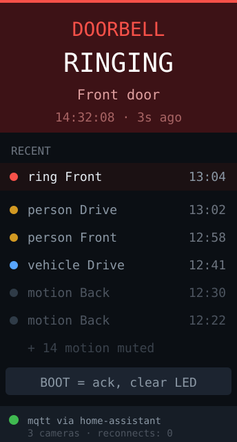

# protect-doorbell — idea



A UniFi Protect event panel. Doorbell rings and camera motion appear as a live
feed with camera name and timestamp, the LED flashes on a ring, and recent
events stay listed so you can see what you missed.

**Why this board:** a ring needs to be noticed, not read — the RGB LED does that
from across a room and the screen answers "which camera, when". The tall panel
holds ~8 recent events. This is the app where being a *dedicated* device beats a
phone notification, because it can't be buried under other notifications.

## Protect is a websocket, not a REST poll

This is the important design difference from [unifi-status](../unifi-status/).
Protect pushes events over a websocket rather than exposing a "recent events"
endpoint you'd poll, and you want that: polling adds latency to a doorbell,
which is the one place latency is unacceptable.

The practical shape:

1. Authenticate to UniFi OS and hold the session.
2. Open the Protect events websocket.
3. Decode event frames, filter for ring and motion on the cameras you care
   about.

**Two warnings.** First, the Protect API is **undocumented and unstable** —
it has changed shape across UniFi OS releases, and the community libraries
(`uiprotect`, `unifi-protect` in Home Assistant) exist precisely because of
that churn. Second, the event frames are a **binary packet format**, not plain
JSON — headers plus zlib-compressed payloads. Decoding that on an MCU is real
work, and it's the part most likely to break on a firmware update.

## Strongly consider letting Home Assistant do it

If you already run Home Assistant, its Protect integration is maintained by
people tracking Ubiquiti's changes for you. Subscribe to an MQTT topic from the
C6 and the entire hard part disappears:

```
ring  → homeassistant/binary_sensor/front_doorbell/state
```

`PubSubClient` and a 20-line handler replaces a websocket client, a session
manager, and a binary protocol decoder that you'd be re-fixing after every
UniFi OS update. Same for a small script on the [mac-mini](../mac-mini/) using
`uiprotect` and republishing to MQTT.

Go direct-to-Protect only if you specifically want no broker in the path.

## Hard parts

- **Camera snapshots are mostly out of reach.** A thumbnail is the obvious next
  wish, but 512KB of SRAM with no PSRAM means JPEG decode into a 172×320 region
  is tight even when pre-resized — and Protect serves full-resolution frames.
  If you want a snapshot, resize it upstream (on the Mac or in HA) and serve the
  C6 an already-172px-wide JPEG.
- **A doorbell that misses a ring is worthless**, so reconnection is the whole
  reliability story: backoff-and-retry on both Wi-Fi and the transport, and show
  connection state on screen at all times. A silent panel must be visibly
  "disconnected", never just idle.
- **Motion is noisy.** Unfiltered motion on several cameras will scroll a ring
  off the screen within seconds. Rank ring above motion, keep rings pinned, and
  rate-limit motion per camera.
- Do not put the LED on full brightness for motion — reserve loud signalling for
  rings, or you'll stop noticing it. Keep both brightness values as tunable
  constants.
- Acknowledge with the one button (GPIO9): short press clears the LED, leaves
  the list.

**Pieces:** `PubSubClient` (recommended path) or `ArduinoWebsockets` +
`WiFiClientSecure` for direct Protect, `ArduinoJson`, Arduino_GFX,
`Preferences` for config, `secrets.h` for credentials.

**Effort:** small via MQTT/Home Assistant. Large and fragile direct to Protect —
and the fragility is Ubiquiti's release cadence, not your code.
