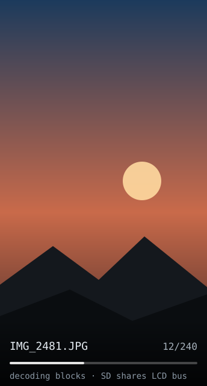

# sd-photo-frame — idea

Slideshow of images off the microSD card. Drop JPEGs in a folder, it cycles them
with a fade or slide transition.

**Why this board:** it has the TF slot, and this is the only app that justifies
it. Also the only app here needing no network at all.

**Hard parts**

- **SD and LCD share the SPI bus** (MOSI 6 / SCLK 7). You cannot stream from the
  card and push pixels simultaneously — decode a chunk, then draw it, and make
  sure only one CS is low at a time. Arduino_GFX's `is_shared_interface` flag
  matters here.
- No PSRAM and 512KB SRAM: a full 172×320×16bpp framebuffer is ~110KB, which is
  survivable, but a JPEG decoder's working buffers on top of it are not
  comfortable. Decode and blit in MCU-sized blocks (`JPEGDEC` does this).
- Images won't be 172×320. Either pre-resize on the computer (much easier) or
  write scaling code. Pre-resize.
- Cheap SD cards fail at higher SPI clocks. Leave the clock rate as a tunable
  constant; start slow.

**Pieces:** `SD` or `SdFat`, [`JPEGDEC`](https://github.com/bitbank2/JPEGDEC)
(designed for exactly this MCU-block pattern), Arduino_GFX.

**Effort:** medium. The bus sharing is the real work; the slideshow logic is
trivial.
