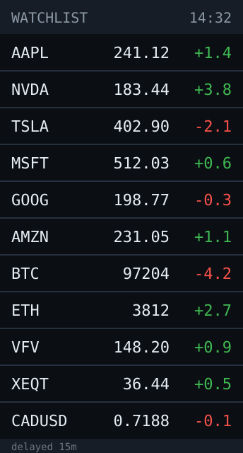
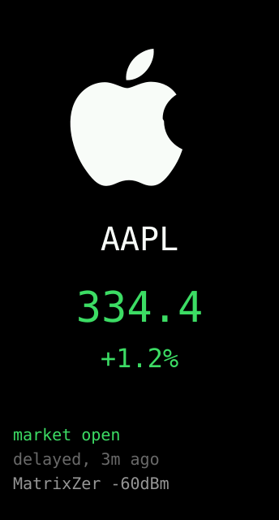

# ticker — built




A watchlist panel. **One colour scheme only** — black background, white
symbols, green and red numbers — and **two layouts**, cycled by a 2s hold:

| Layout | What it shows |
|---|---|
| **LIST** | Six rows: symbol, price, signed change. A longer list pages through six at a time every 8s. |
| **SOLO** | One symbol filling the screen with its logo, advancing every 5s. |

The chosen layout persists in NVS, so it survives a power cycle.

**Flashed and verified** — 12 symbols (8 stocks, 4 coins) all fetching, 12/12
logos present, 44.1°C die temperature, ~305KB heap free, 41.0% of the 3MB app
partition.

## Buttons

Same gestures as every app here, with one deliberate substitution:

| Gesture | Action |
|---|---|
| tap (< 2s) | rotate through the four orientations |
| hold 2s | **next layout** (other apps: next colour scheme) |
| hold 4.5s | screen off |

Ticker pins scheme 0 and spends the colour gesture on the layout instead, since
a stock panel wants exactly one palette. `ui.h` grew one variable for this —
`uiHoldSchemeLabel` — so the hold overlay reads `release: LAYOUT` rather than
promising `COLOUR` and doing something else.

Adding a third layout means an enum value, a geometry constant, a draw function
and a `checkX()` in `selfCheck()`. Nothing else dispatches on the mode.

## Logos

`tools/make-logos.py` fetches each symbol's logo, converts it to raw RGB565 at
96×96 and writes it into `data/logo/`, which then ships via `uploadfs`:

```sh
python3 tools/make-logos.py
PLATFORMIO_DATA_DIR=apps/ticker/data pio run -e ticker -t uploadfs
```

**The firmware carries no PNG decoder and fetches no images.** It opens
`/logo/<LABEL>.565`, checks the length is exactly 96×96×2, and blits it. That
keeps a decoder, a third TLS endpoint and an 18KB decode buffer off a 512KB
single-core part, and a missing logo becomes an ordinary case — the symbol is
drawn large instead — rather than a runtime failure. 12 logos is 221KB, 24% of
the data partition. The boot log inventories them (`logos: 12/12 present`) and
names any that are missing.

Sources, both tested and keyless: `financialmodelingprep.com/image-stock/` for
stocks, `assets.coincap.io/assets/icons/` for coins. `logo.clearbit.com` no
longer resolves at all and `img.logo.dev` wants a token, so neither is used.
Coincap keys on the ticker rather than the CoinGecko id, so a coin's `label` is
what gets looked up — a custom label that isn't a real ticker just falls back to
text.

**The conversion is where the interesting failure was.** These logos arrive in
three different shapes and a black screen punishes two of them:

- Most are transparent, and composite onto black correctly.
- Apple's is **solid black on opaque white**. Flattened naively it produces a
  perfectly valid file that draws *nothing*. The converter detects the light
  background from the image border, knocks it out to black, and inverts the
  dark glyph — giving a white Apple mark.
- Solana's PNG has **no alpha channel at all**, so `sips` emits 24bpp rather
  than 32bpp.

My first heuristic averaged luminance over the whole image. That broke Solana
precisely because it has no alpha: its black background counted as visible
pixels, the mean came out at luma 24, and the "too dark, invert it" rule flipped
the entire logo to a white square. **Read the background from the border, never
from the average.** The decision is made on the Mac, where there is full colour
information, and costs the firmware zero bytes.

## The watchlist is a file on the device, not source code

[`data/watchlist.json`](data/watchlist.json) lives on the board's LittleFS
partition, so **changing symbols does not need a rebuild**:

```sh
# firmware (only when src/ changes)
pio run -e ticker -t upload

# the watchlist (after editing data/watchlist.json)
PLATFORMIO_DATA_DIR=apps/ticker/data pio run -e ticker -t uploadfs
```

`huge_app.csv` already leaves an `0xE0000` (896KB) data partition spare, which
LittleFS formats on first use — no partition change was needed.

The `PLATFORMIO_DATA_DIR` prefix is there because `data_dir` is a `[platformio]`
option and cannot be set per-env. With one app using a filesystem, overriding it
at the call site beats pointing the whole project at one app's data directory.

`addRow()` is a **trust boundary** — that file is hand-edited, so labels longer
than the 5-glyph symbol box are rejected, empty ids are rejected, and the
24-symbol cap is enforced rather than assumed. Rejected entries are named in the
serial log instead of vanishing. If the file is missing or malformed the screen
says so *and prints the uploadfs command*, rather than going blank.

## The API question, tested rather than assumed

Measured from a laptop before writing any firmware:

| Source | Result |
|---|---|
| **Yahoo v8 chart** (`/v8/finance/chart/AAPL?range=1d&interval=1d`) | **Works, no key.** 1298 bytes. `meta.regularMarketPrice` and `meta.chartPreviousClose` are all a percent change needs. **One symbol per request.** |
| **CoinGecko** (`/api/v3/simple/price`) | **Works, no key.** Eight coins in **486 bytes, one request**, with `usd_24h_change` included. |
| Stooq CSV | **Dead.** 404 on every documented URL form. |
| Yahoo v7 `/finance/quote?symbols=` | **401.** Needs a crumb/cookie now, which is not worth doing on an MCU. |

**Yahoo returns HTTP 429 with no User-Agent.** An MCU sends none by default, so
without an explicit header it rate-limits immediately and presents as a broken
app rather than a rejected request. The firmware sets one.

That asymmetry drives the whole polling design: **coins are one cheap request,
stocks are one request per symbol.** So:

- Stock fetches are **sequential on a single reused `NetworkClientSecure`** —
  each TLS session costs ~40KB of a 512KB heap, so they cannot overlap.
- The refresh interval has a **floor of roughly one request per minute**
  (`stockEvery = max(interval, nStocks × 60s)`). Twelve stocks every five
  minutes would be 144 requests/hour and Yahoo starts answering 429. Long lists
  trade freshness for breadth, deliberately and visibly.
- **Polling follows market hours.** 5 min between 09:30 and 16:00 ET on
  weekdays, hourly otherwise; coins keep their own 5-minute cadence because
  crypto never closes. `marketOpen()` is asserted in `selfCheck()`.

## Scrolling: why it pages instead of sliding

The ask was a smooth scroll for a longer list. Three options, in order of cost:

1. **ST7789 hardware vertical scroll** (`VSCRDEF`/`VSCRSAR`) — free, no CPU.
   **Doesn't apply.** It wraps *within* the 320-line frame, so 12 symbols at a
   38px pitch (456px) cannot fit regardless; and Arduino_GFX exposes no scroll
   API, so it would mean raw panel commands. Also scrolls along the native axis,
   which is sideways once the board is rotated to landscape.
2. **Pixel-wise slide** — repaints the entire row region every frame. That is
   172×250px over SPI on one core already down-clocked to 80MHz for heat.
   Expensive, and the thing it buys is decoration.
3. **Paged window with a staggered redraw** — what shipped. Every 8s the page
   flips and the six rows redraw top-to-bottom with a 22ms stagger, so it reads
   as movement rather than a blink. **It costs nothing extra** — the same
   redraws, just spaced out.

The header shows `1/2` so a flip can't be mistaken for prices changing. The row
cache is keyed **per screen slot, not per symbol**, so turning the page
invalidates it — otherwise a slot holding an unchanged string would keep the
previous page's symbol.

## Readability

Six rows at text size 2 is the budget, and it is a layout fact rather than a
preference — `checkLayout()` asserts that both orientations hold exactly one
page, that the symbol box cannot reach the price box, and that the footer does
not land on the last row. Size 1 (6×8px glyphs) is already known to be too small
to read on this panel, which is the complaint that got desk-clock's forecast
enlarged.

Landscape uses two columns of three, so a page is six rows in both orientations.

Solo is the layout most likely to overflow — a 96px logo plus three text sizes
plus a footer — and 172px-tall landscape is the tight case. `checkSolo()`
asserts each element against the panel *and* against the element below it, plus
that the logo is either above the text (portrait) or beside it (landscape).

## What the self-check caught

`selfCheck()` runs before the display initialises and asserts on failure, so a
layout bug is a boot loop with a line number rather than a subtly wrong screen.
Two real finds during this build:

- **A landscape overflow.** Rows ended at y=132 but the footer started at y=130.
  The two asserts together pin the only legal window, 132–140.
- **A bad assertion of mine, not bad code.** `formatPct(2.35f)` was expected to
  give `+2.4%`; it correctly gives `+2.3%`, because `2.35f` is really
  `2.3499999`. Don't assert what a half-way float literal rounds to — the test
  values now sit off the boundary, with a comment saying why.

`formatPrice()` has a 7-character box and shrinks precision as the number grows,
because `0.4215` and `79010` have to fit the same space. Percent change is
**always signed**, so green/red is never the only cue.

## Hard parts, still true

- Delayed data is likely (Yahoo runs ~15 min behind on some exchanges). The
  footer says `delayed, Nm ago` rather than implying live prices.
- Back off hard on 429 and never retry a rate-limit tightly. The request floor
  above is the main defence; the HTTP code is named in the serial log.
- A misspelled symbol returns 200 with no price field. That is logged as
  `no price in payload (bad symbol?)` so it isn't mistaken for a network fault —
  the row just shows `--` in the dim colour.
- `client.setInsecure()` is deliberate: these are public read-only quotes, and
  certificate pinning on a desk device whose flash can be dumped buys nothing.
  See [SECURITY.md](../../../SECURITY.md).

**Pieces:** `NetworkClientSecure`, `ArduinoJson` v7 with filters, `LittleFS`,
`<ui.h>` for schemes/rotation/gestures, `<netjoin.h>` for the BSSID-pinned join.
