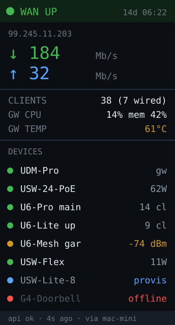

# unifi-status — idea



The homelab's network on one glanceable panel: WAN state and public IP, live
up/down throughput, client count, and a row per UniFi device with its health,
load and PoE draw.

**Why this board:** a UniFi site is fundamentally *a list of devices with a
number each*, which is exactly what a 172×320 portrait panel does best — about
10 device rows with no scrolling. No touch needed because there's nothing to
control, only to watch. And the RGB LED gives you WAN state from across the
room: green up, amber degraded, red down.

## Auth — use an API key, not a password

Ubiquiti now has an **official API with key auth**, which is the right path and
avoids the mess that came before it. Generate one in the Network application
under **Integrations → Create New API Key** (it's shown once, copy it then).

```
GET https://<gateway>/proxy/network/integrations/v1/sites
Header: X-API-KEY: <key>
```

Two reasons this matters:

- **MFA doesn't apply to API keys.** When Ubiquiti enforced MFA on ui.com
  accounts, every username/password integration broke. Keys bypass the auth flow
  entirely and live until revoked.
- **No CSRF dance.** The session-auth fallback requires reading an
  `X-CSRF-Token` from the login response and replaying it on every write, and
  with 2FA on it returns HTTP 499 before you even get that far.

The official integration API is fairly thin. For richer per-device stats the
**legacy endpoints** are still what most tooling uses, and the same API key
works:

```
/proxy/network/api/s/{site}/stat/device    per-device health, uptime, PoE
/proxy/network/api/s/{site}/stat/sta       connected clients
/proxy/network/api/s/{site}/stat/health    per-subsystem (wan/wlan/lan) status
```

Responses are `{"meta":{"rc":"ok"},"data":[...]}` — check `meta.rc` before
trusting `data`, because errors come back as `rc: "error"` with a `msg`, not as
an HTTP error code.

## Don't reach for SNMP

The obvious "no TLS, no JSON, tiny packets" shortcut for an MCU doesn't hold up
here. SNMP still exists in UniFi but it's de-emphasized and patchy: **it is not
available for the controller itself on Dream Machine hardware** (so no gateway
CPU, memory or WAN stats — the numbers you most want), USW Flex and Ultra
switches don't support it at all, the shipped MIBs are incomplete for newer
models, and there are still no traps. It works for older APs and switches and
not much else. Use the API.

## Hard parts

- **TLS is the real constraint, not the API.** The gateway serves a self-signed
  cert, and each `WiFiClientSecure` session costs a large slice of a 512KB heap.
  Two options, and the second is much better:
  1. `client.setInsecure()` and talk to the gateway directly. Fine on a trusted
     LAN, and one reused client, but you'll be close to the heap ceiling once
     Arduino_GFX has its buffers.
  2. **Put a reducer in front of it.** Have the Mac mini (see
     [mac-mini](../mac-mini/)) poll UniFi over HTTPS and serve the C6 ~15 plain
     numbers over plain HTTP on the LAN. No TLS on the MCU, no big JSON parse,
     and the API key never leaves the Mac. This is the lazy correct answer.
- **`/stat/device` responses are huge** — tens of KB per device with dozens of
  fields you don't want. If you do parse on-device, an `ArduinoJson` filter is
  mandatory, not an optimization; a whole-document parse will exhaust heap on a
  site with more than a couple of APs.
- Throughput must be computed from **counter deltas over time**, and those
  counters reset on device reboot. A negative delta means reboot, not negative
  traffic — clamp it or you'll display nonsense right when you most want the
  panel to be right.
- Poll gently. Every 5–10s is plenty; per-second polling on a gateway that's
  also routing your traffic is rude and buys nothing on a panel you glance at.
- Show **last-updated** somewhere. A frozen panel showing a healthy WAN is worse
  than a blank one.

**Pieces:** `WiFiClientSecure` + `HTTPClient` + `ArduinoJson` (with filters),
`Preferences` for gateway address/site/key, Arduino_GFX. Keep the API key in
`secrets.h` (already gitignored) — never in a tracked source file.

**Effort:** medium. Start by curling the endpoints from your laptop to see the
real response shapes before writing any firmware — the API docs and reality
differ in places.
