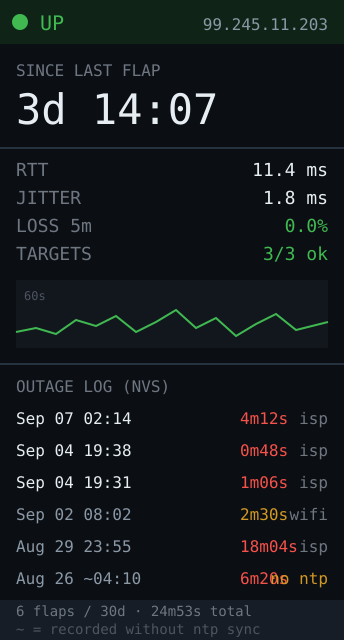

# wan-watchdog — idea

A dedicated ISP accountability display. Current WAN state and public IP, live
latency and packet loss, uptime since the last flap, and a scrolling log of every
outage with its timestamp and duration.

**Why this board:** the log *is* the product, and a tall narrow panel is a log
viewer. It also wants to run for months untouched on USB power with no
interaction — no touch, no battery, exactly this board. The LED is the headline:
green up, amber degraded, red down, so you know before you open a laptop.

**Why it's worth building even though UniFi shows this:** UniFi's own WAN history
is coarse and it forgets. A device that has been sitting there for six months
with a timestamped flap log is what you actually need when you phone the ISP and
they tell you the line has been stable.

## Two ways to do it, and the simpler one is better

**Ping-only (recommended).** Don't touch the UniFi API at all. Ping a stable
external target every few seconds, track RTT and loss, and derive state from
that. No API key, no TLS, no JSON, no heap pressure — it fits in a fraction of
the C6's RAM and can't break when Ubiquiti changes an endpoint. It also measures
what you actually care about: whether *the internet* works, not whether the
gateway thinks it does.

**With the UniFi API**, you additionally get the public WAN IP, the ISP-reported
link speed, and which WAN a dual-WAN setup failed over to. Worth adding later —
see [unifi-status](../unifi-status/) for the API key setup, and note the same TLS
heap caveat applies.

## Hard parts

- **Pick the ping target carefully.** `8.8.8.8` deprioritises ICMP, so you'll
  measure Google's rate-limiter as much as your line. Ping two or three
  unrelated targets and treat "all down" as an outage, "one down" as noise —
  otherwise you'll log outages that never happened.
- **Distinguish the failure modes.** Wi-Fi dropping, the gateway rebooting, and
  the ISP going down all look identical from a single failed ping. Check the
  gateway's LAN IP first: if that answers, the WAN is the problem; if it doesn't,
  your own link is. Logging "ISP outage" when your Wi-Fi blipped makes the whole
  log worthless.
- **The log has to survive reboots**, or a power cut erases the evidence you
  built this to collect. Write flap events to NVS via `Preferences` (a small
  ring buffer of ~30 entries), or append to the SD card for real history.
  Watch NVS write endurance — log *transitions* only, never a periodic sample.
- **Get the time right before logging.** NTP won't resolve while the WAN is
  down, so timestamps around an outage are exactly when the clock is least
  trustworthy. Sync when up, keep counting on `millis()` when down, and mark
  entries recorded without a fresh sync.
- Debounce state changes. A single dropped packet is not an outage; require
  N consecutive failures before flipping state, and hysteresis on the way back.

**Pieces:** `ESP32Ping` or raw ICMP via lwIP, `Preferences` for the flap ring
buffer, `configTzTime` for NTP, Arduino_GFX. Optionally `SD` for long history.

**Effort:** small — and it's the one app here with **no external dependency to
break**. Good candidate for the second thing you build on this board.
