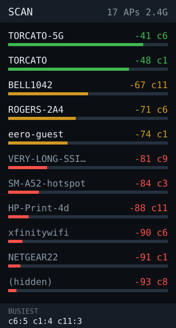

# wifi-scanner — idea

Continuous scan showing nearby APs ranked by signal: SSID, RSSI bar, channel,
encryption. A pocket site-survey tool for finding dead spots and channel
congestion.

**Why this board:** zero external services — no API keys, no network config, it
works the moment it boots. The tall list shape fits ~12 APs. And the C6 has a
Wi-Fi 6 radio, so it sees 802.11ax APs and can report the 2.4GHz band honestly.

**Hard parts**

- `WiFi.scanNetworks()` blocks for seconds. Use the async form
  (`WiFi.scanNetworks(true)`) and poll `scanComplete()`, or the UI locks up every
  cycle.
- Rows jump around as RSSI fluctuates. Sort by BSSID for stable positions and
  show a smoothed RSSI, or the list is unreadable.
- SSIDs are longer than 172px. Truncate with an ellipsis; don't wrap.

**Pieces:** `WiFi.h` only. No dependencies, no accounts.

**Effort:** small. Best candidate for the second app — self-contained, and it
exercises list rendering that `ticker` also needs.
