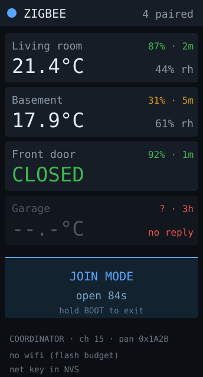

# zigbee-hub — idea

Talk to Zigbee sensors directly over the C6's 802.15.4 radio and show their
readings on screen. No Home Assistant, no USB coordinator dongle, no MQTT broker
— the board *is* the coordinator.

**Why this board:** this is the one app nothing else on the wishlist can do.
802.15.4 is the C6's genuine differentiator; every other board here is Wi-Fi/BLE
only. Cheap Zigbee temperature/humidity/door sensors are ~$10 and run years on a
coin cell.

**Hard parts** — this is the ambitious one, don't start here.

- Arduino-ESP32 core 3.x ships a `Zigbee` library wrapping `esp-zigbee-sdk`, but
  it is young and the coordinator role is less travelled than the end-device
  role. Expect to read SDK examples, not tutorials.
- Zigbee needs non-volatile storage for the network key and the device table, so
  pairings survive reboots. Budget a partition and `Preferences`/NVS work.
- The Zigbee stack is not small. On 4MB flash with no PSRAM, stack + Arduino_GFX
  + Wi-Fi together may not fit — you will likely have to drop Wi-Fi entirely and
  use a custom partition table.
- Pairing with one button (GPIO9) and no touchscreen: plan a long-press to enter
  join mode, and show join state on the RGB LED.

**Pieces:** `Zigbee.h` from core 3.x, `Preferences`, a custom
`board_build.partitions` CSV.

**Effort:** large, and genuinely uncertain. Verify a bare Zigbee coordinator
example builds and pairs *before* adding any display code.
