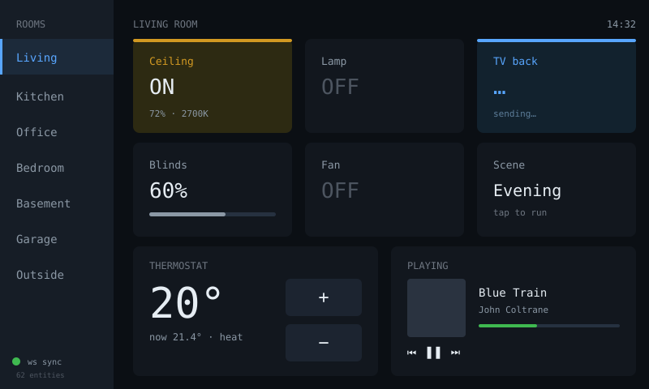

# ha-panel — idea

Full-size Home Assistant control surface: room tabs, light and switch tiles with
live state, thermostat control, media controls, camera snapshots.

**Why this board:** at 800×480 with 5-point capacitive touch, this is a tablet
replacement rather than a compromise. The 2.8" CYD can do a cut-down version;
this can show a whole floor's worth of controls at once.

**Read this before writing code:** **ESPHome already does this in YAML**, with
native Home Assistant discovery, OTA updates, and no reconnect logic to write.
Waveshare markets this board as ESPHome-compatible for exactly this reason.
Writing it by hand in Arduino/LVGL means reimplementing state sync, entity
discovery, and OTA — weeks of work to arrive somewhere slightly worse.

Build it in Arduino only if you want something ESPHome genuinely can't express,
or if the point is the learning rather than the panel.

**Hard parts (if hand-rolled anyway)**

- State sync must be push-based over the HA WebSocket API, with full resync on
  reconnect. Polling produces a panel that lies.
- Entity count: a floor of devices is a lot of live state to hold and lay out;
  drive the layout from a config file, not from code.
- Camera snapshots mean JPEG decode into PSRAM at a size that fits a tile —
  budget memory carefully alongside the 750KB framebuffer.
- Optimistic tap feedback with visible revert on failure, same as the CYD panel.

**Pieces:** ESPHome (recommended), or LVGL + `ArduinoWebsockets` + HA WebSocket
API + `ArduinoJson`.

**Effort:** small in ESPHome. Very large by hand.
