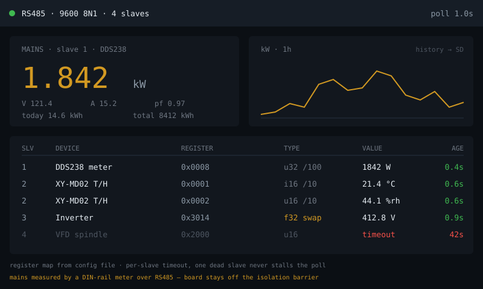

# modbus-readout — idea

Poll RS485/Modbus RTU devices — energy meters, VFDs, industrial temperature and
humidity transmitters, solar inverters — and show live values with rolling
charts.

**Why this board:** the **RS485 header**. Modbus RTU is how a large amount of
real industrial and energy hardware talks, and a 7" panel is the natural size
for a multi-device readout. An energy meter on the house mains is the obvious
first target.

**Hard parts**

- Modbus register maps are per-device and often badly documented. You will spend
  more time reading a vendor PDF than writing code. Keep the map in a config
  file so a new device doesn't need a re-flash.
- Endianness and data types: 32-bit values split across two 16-bit registers,
  in either word order, sometimes float, sometimes scaled int. Getting this
  wrong yields plausible-looking wrong numbers, which is the worst failure mode.
  Cross-check against the device's own display.
- RS485 is a shared bus: correct termination, one master, and a per-slave
  timeout. One unresponsive device must not stall the poll loop for everything
  else.
- **Anything wired to mains is an electrical job, not a software one.** A
  clamp-type or DIN-rail meter that reports over RS485 keeps the board on the
  safe side of the isolation barrier — do that rather than measuring directly.
- Historical charts need storage: SD card or push to an external time-series
  store. 8MB PSRAM is not a database.

**Pieces:** `ModbusMaster` or `eModbus`, LVGL charts, `SD` or an HTTP push to
InfluxDB/Prometheus for history.

**Effort:** medium. The code is straightforward; device integration is the work.
