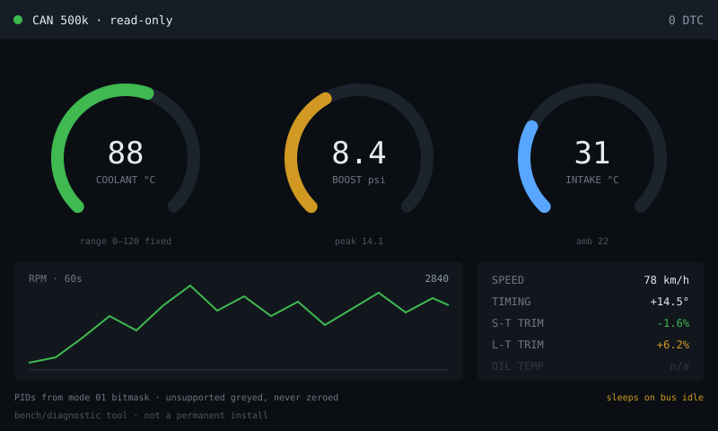

# obd2-gauge — idea

Plug into a car's OBD-II port and show live telemetry the dashboard doesn't:
coolant and oil temp, boost, intake temp, timing advance, fuel trims, plus
read/clear trouble codes. Big dials, live line charts.

**Why this board:** the **CAN header** is why. No other board in the collection
can reach a vehicle bus without extra hardware, and 800×480 is enough room for
several gauges plus a scrolling chart at once.

**Hard parts** — and some of these are safety, not convenience.

- **Read-only, always.** Passive listening plus standard OBD-II PID requests is
  fine. Writing arbitrary CAN frames to a live vehicle bus can affect how the
  car behaves — don't build a frame injector into a dashboard app.
- The CAN header still needs correct wiring to the OBD-II connector's CAN-H/L
  pins and the right termination; check the wiki's transceiver details. Getting
  bus speed wrong (500kbps vs 250kbps varies by vehicle) means silence.
- PID support is per-manufacturer and inconsistent. Query mode 01 PID 00 for the
  supported-PID bitmask and grey out what the car doesn't provide, rather than
  showing zeros.
- Power comes from the OBD port, which stays live on some cars with the ignition
  off — a board drawing current for a week flattens the battery. Sleep or cut
  power on bus inactivity.
- Automotive vibration and heat: nothing about a 7" dev board is car-grade.
  Treat it as a bench/diagnostic tool, not a permanent install.

**Pieces:** `TWAI` (the ESP32's native CAN driver in core 3.x / ESP-IDF), LVGL,
an OBD-II PID table.

**Effort:** medium-large, and hardware-dependent. Verify you can read *one* PID
into serial output before building any UI.
