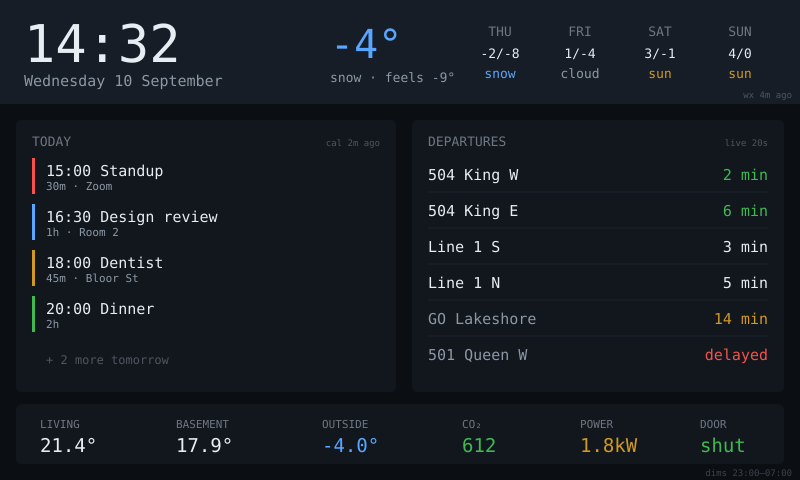

# wall-dashboard — idea

The reason to buy this board. A wall-mounted status screen: today's calendar
down one side, weather and forecast across the top, transit departures, and a
row of house sensor readings. Readable from across the room, touch only for the
occasional page switch.

**Why this board:** 800×480 is the first size here where you can show four
information blocks at once without cramming. Capacitive touch means the
occasional tap works properly. And PSRAM's ~26fps ceiling is irrelevant for
content that updates once a minute.

**Hard parts**

- **Data plumbing is the whole project**, not the display. Calendar means OAuth
  against Google/CalDAV, which is genuinely painful on an MCU — strongly
  consider a small server (or a Cloudflare Worker) that does the auth and serves
  the board one pre-digested JSON blob. That also keeps tokens off the device.
- Screen burn and light pollution: a static bright layout runs 24/7. Dim or blank
  on a schedule, and keep the brightness curve tunable.
- Wi-Fi will drop. Show last-updated timestamps per block so stale data is
  obvious instead of silently wrong.
- Mounting and power: it's a 7" panel needing a permanent USB feed. Plan the
  physical install before the software, it constrains where it can go.

**Pieces:** LVGL, `Arduino_ESP32RGBPanel`, `ArduinoJson` (with filters),
a server-side aggregator for anything needing OAuth.

**Effort:** large — mostly integration work. Build the aggregator first and view
its JSON in a browser before touching the board.
